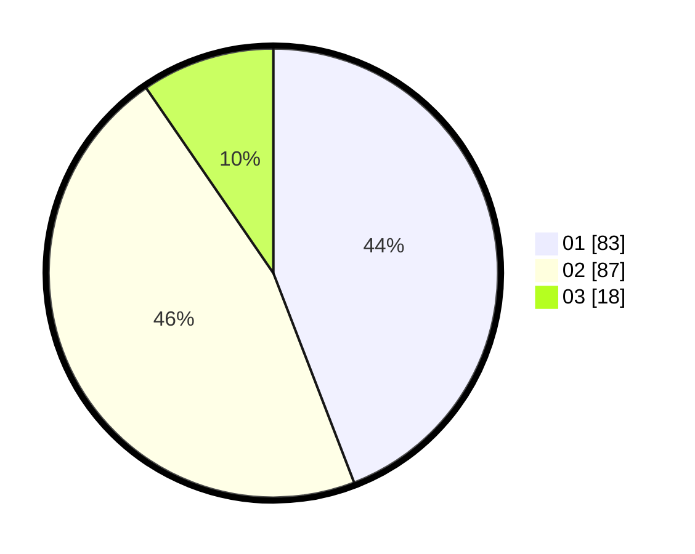

# Hasil

Hasil perolehan suara paslon dapat dilihat pada file paslon-01.txt, paslon-02.txt, dan paslon-03.txt.

Jika tidak ada, artinya data tersebut belum ada pada SIREKAP.

## Perolehan Suara

 * Paslon 01: **83**.
 * Paslon 02: **87**.
 * Paslon 03: **18**.

## Foto C Plano

https://sirekap-obj-formc.kpu.go.id/18b7/pemilu/ppwp/31/72/01/10/05/3172011005005-20240214-184902--db89205c-f830-4772-b4a4-932b48faa8d3.jpg

https://sirekap-obj-formc.kpu.go.id/18b7/pemilu/ppwp/31/72/01/10/05/3172011005005-20240214-184642--ab5b93b6-2ec6-4d17-af12-58650e87f863.jpg

https://sirekap-obj-formc.kpu.go.id/18b7/pemilu/ppwp/31/72/01/10/05/3172011005005-20240214-184645--89d7181e-51ee-4c85-ae8f-3c8a44acc9e9.jpg

## DATA PEMILIH TETAP

Jumlah pemilih dalam DPT: **295**.
 * L: **157**.
 * P: **138**.

## DATA PENGGUNA HAK PILIH

Jumlah pengguna hak pilih dalam DPT: **184**.
 * L: **93**.
 * P: **91**.

Jumlah pengguna hak pilih dalam DPTb: **5**.
 * L: **1**.
 * P: **4**.

Jumlah pengguna hak pilih dalam DPK: **0**.
 * L: **0**.
 * P: **0**.

Jumlah pengguna hak pilih: **189**.
 * L: **94**.
 * P: **95**.

## JUMLAH SUARA SAH DAN TIDAK SAH

JUMLAH SELURUH SUARA SAH: **188**.

JUMLAH SUARA TIDAK SAH: **1**.

JUMLAH SELURUH SUARA SAH DAN SUARA TIDAK SAH: **189**.
