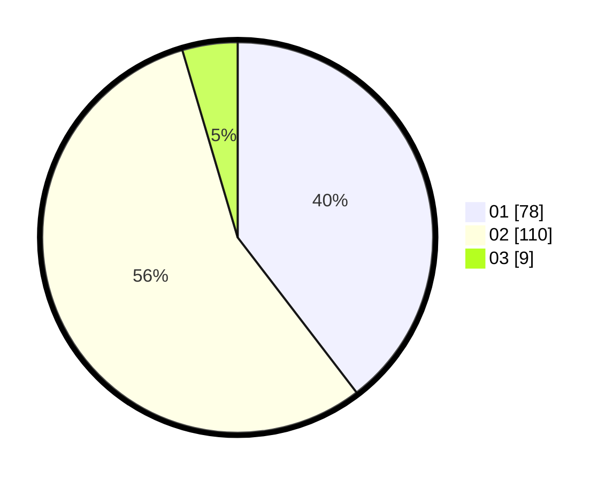

# Hasil

Hasil perolehan suara paslon dapat dilihat pada file paslon-01.txt, paslon-02.txt, dan paslon-03.txt.

Jika tidak ada, artinya data tersebut belum ada pada SIREKAP.

## Perolehan Suara

 * Paslon 01: **78**.
 * Paslon 02: **110**.
 * Paslon 03: **9**.

## Foto C Plano

https://sirekap-obj-formc.kpu.go.id/3476/pemilu/ppwp/31/72/01/10/05/3172011005007-20240216-150949--c0340e3e-ec0e-40ed-87bf-689851023aa2.jpg

https://sirekap-obj-formc.kpu.go.id/3476/pemilu/ppwp/31/72/01/10/05/3172011005007-20240216-151136--972ad64d-4afb-4ed1-8d77-90ee36f38c39.jpg

https://sirekap-obj-formc.kpu.go.id/3476/pemilu/ppwp/31/72/01/10/05/3172011005007-20240216-151236--1a645f2a-9511-4bcd-a366-95cc6cd24d61.jpg
