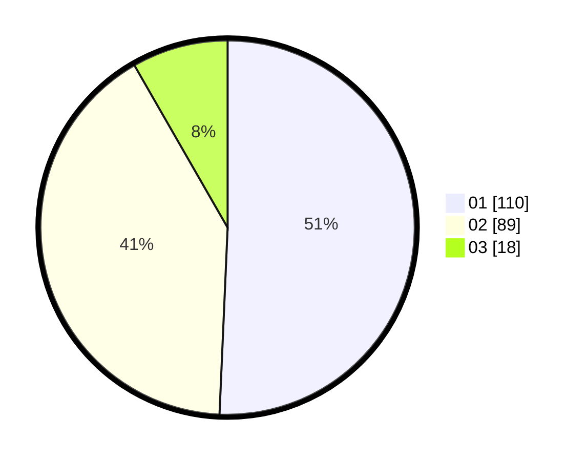

# Hasil

Hasil perolehan suara paslon dapat dilihat pada file paslon-01.txt, paslon-02.txt, dan paslon-03.txt.

Jika tidak ada, artinya data tersebut belum ada pada SIREKAP.

## Perolehan Suara

 * Paslon 01: **110**.
 * Paslon 02: **89**.
 * Paslon 03: **18**.

## Foto C Plano

https://sirekap-obj-formc.kpu.go.id/3457/pemilu/ppwp/31/72/01/10/05/3172011005014-20240214-190437--608a06b5-9798-4038-8a0a-d81938affdcf.jpg

https://sirekap-obj-formc.kpu.go.id/3457/pemilu/ppwp/31/72/01/10/05/3172011005014-20240214-190557--fb4fdfc8-5629-4a62-88d3-f9fdf6afa952.jpg

https://sirekap-obj-formc.kpu.go.id/3457/pemilu/ppwp/31/72/01/10/05/3172011005014-20240214-190645--7d57cdfe-e5af-44f7-96c9-6020e263697d.jpg

## DATA PEMILIH TETAP

Jumlah pemilih dalam DPT: **285**.
 * L: **152**.
 * P: **133**.

## DATA PENGGUNA HAK PILIH

Jumlah pengguna hak pilih dalam DPT: **211**.
 * L: **109**.
 * P: **102**.

Jumlah pengguna hak pilih dalam DPTb: **0**.
 * L: **0**.
 * P: **0**.

Jumlah pengguna hak pilih dalam DPK: **8**.
 * L: **3**.
 * P: **5**.

Jumlah pengguna hak pilih: **218**.
 * L: **112**.
 * P: **107**.

## JUMLAH SUARA SAH DAN TIDAK SAH

JUMLAH SELURUH SUARA SAH: **217**.

JUMLAH SUARA TIDAK SAH: **2**.

JUMLAH SELURUH SUARA SAH DAN SUARA TIDAK SAH: **219**.
