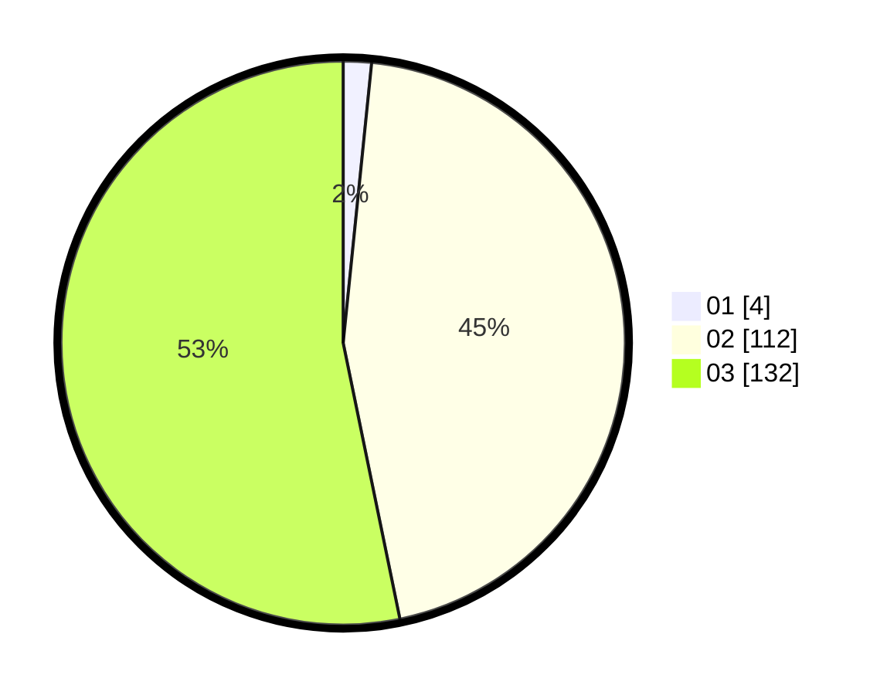

# Hasil

Hasil perolehan suara paslon dapat dilihat pada file paslon-01.txt, paslon-02.txt, dan paslon-03.txt.

Jika tidak ada, artinya data tersebut belum ada pada SIREKAP.

## Perolehan Suara

 * Paslon 01: **4**.
 * Paslon 02: **112**.
 * Paslon 03: **132**.

## Foto C Plano

https://sirekap-obj-formc.kpu.go.id/2164/pemilu/ppwp/31/72/01/10/05/3172011005035-20240217-105336--bc93afb9-ca5e-4d80-a057-d72643ae9fca.jpg

https://sirekap-obj-formc.kpu.go.id/2164/pemilu/ppwp/31/72/01/10/05/3172011005035-20240217-105413--0aa30128-d93f-41cb-b867-43386bddc953.jpg

https://sirekap-obj-formc.kpu.go.id/2164/pemilu/ppwp/31/72/01/10/05/3172011005035-20240217-105455--7d104d3d-c31b-4062-bf54-3396c93de87c.jpg

## DATA PEMILIH TETAP

Jumlah pemilih dalam DPT: **233**.
 * L: **112**.
 * P: **121**.

## DATA PENGGUNA HAK PILIH

Jumlah pengguna hak pilih dalam DPT: **233**.
 * L: **112**.
 * P: **121**.

Jumlah pengguna hak pilih dalam DPTb: **17**.
 * L: **7**.
 * P: **10**.

Jumlah pengguna hak pilih dalam DPK: **3**.
 * L: **2**.
 * P: **1**.

Jumlah pengguna hak pilih: **253**.
 * L: **121**.
 * P: **132**.

## JUMLAH SUARA SAH DAN TIDAK SAH

JUMLAH SELURUH SUARA SAH: **248**.

JUMLAH SUARA TIDAK SAH: **5**.

JUMLAH SELURUH SUARA SAH DAN SUARA TIDAK SAH: **253**.
