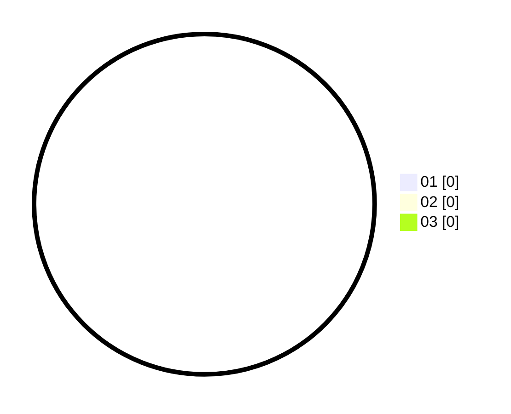

# Hasil

Hasil perolehan suara paslon dapat dilihat pada file paslon-01.txt, paslon-02.txt, dan paslon-03.txt.

Jika tidak ada, artinya data tersebut belum ada pada SIREKAP.

## Perolehan Suara

 * Paslon 01: **0**.
 * Paslon 02: **0**.
 * Paslon 03: **0**.

## Foto C Plano

https://sirekap-obj-formc.kpu.go.id/4ecf/pemilu/ppwp/31/72/01/10/05/3172011005048-20240217-113706--b7045206-0bb8-4e40-a164-36573710b2ec.jpg

https://sirekap-obj-formc.kpu.go.id/4ecf/pemilu/ppwp/31/72/01/10/05/3172011005048-20240217-113731--6cf31b08-e282-432a-b0be-4011e92cb7f4.jpg

https://sirekap-obj-formc.kpu.go.id/4ecf/pemilu/ppwp/31/72/01/10/05/3172011005048-20240217-113800--642fb508-fbcf-4b97-9be0-a9449b5cd992.jpg

## DATA PEMILIH TETAP

Jumlah pemilih dalam DPT: **242**.
 * L: **118**.
 * P: **124**.

## DATA PENGGUNA HAK PILIH

Jumlah pengguna hak pilih dalam DPT: **160**.
 * L: **81**.
 * P: **79**.

Jumlah pengguna hak pilih dalam DPTb: **13**.
 * L: **6**.
 * P: **7**.

Jumlah pengguna hak pilih dalam DPK: **3**.
 * L: **2**.
 * P: **1**.

Jumlah pengguna hak pilih: **176**.
 * L: **89**.
 * P: **87**.

## JUMLAH SUARA SAH DAN TIDAK SAH

JUMLAH SELURUH SUARA SAH: **174**.

JUMLAH SUARA TIDAK SAH: **2**.

JUMLAH SELURUH SUARA SAH DAN SUARA TIDAK SAH: **176**.
