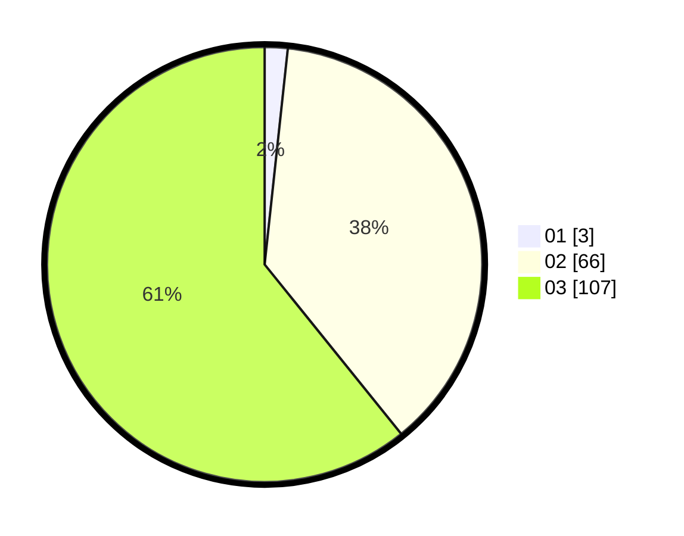

# Hasil

Hasil perolehan suara paslon dapat dilihat pada file paslon-01.txt, paslon-02.txt, dan paslon-03.txt.

Jika tidak ada, artinya data tersebut belum ada pada SIREKAP.

## Perolehan Suara

 * Paslon 01: **3**.
 * Paslon 02: **66**.
 * Paslon 03: **107**.

## Foto C Plano

https://sirekap-obj-formc.kpu.go.id/a430/pemilu/ppwp/31/72/01/10/05/3172011005051-20240217-141514--2b4d0a9c-b98a-4e23-9e3d-991de3574c80.jpg

https://sirekap-obj-formc.kpu.go.id/a430/pemilu/ppwp/31/72/01/10/05/3172011005051-20240217-141551--27c0f0dd-4e79-48de-a073-c6c877a52407.jpg

https://sirekap-obj-formc.kpu.go.id/a430/pemilu/ppwp/31/72/01/10/05/3172011005051-20240217-141630--8e1e869e-400d-4981-b0af-fdc635f571a0.jpg

## DATA PEMILIH TETAP

Jumlah pemilih dalam DPT: **233**.
 * L: **119**.
 * P: **114**.

## DATA PENGGUNA HAK PILIH

Jumlah pengguna hak pilih dalam DPT: **172**.
 * L: **88**.
 * P: **84**.

Jumlah pengguna hak pilih dalam DPTb: **3**.
 * L: **3**.
 * P: **0**.

Jumlah pengguna hak pilih dalam DPK: **5**.
 * L: **2**.
 * P: **3**.

Jumlah pengguna hak pilih: **180**.
 * L: **93**.
 * P: **87**.

## JUMLAH SUARA SAH DAN TIDAK SAH

JUMLAH SELURUH SUARA SAH: **176**.

JUMLAH SUARA TIDAK SAH: **4**.

JUMLAH SELURUH SUARA SAH DAN SUARA TIDAK SAH: **180**.
