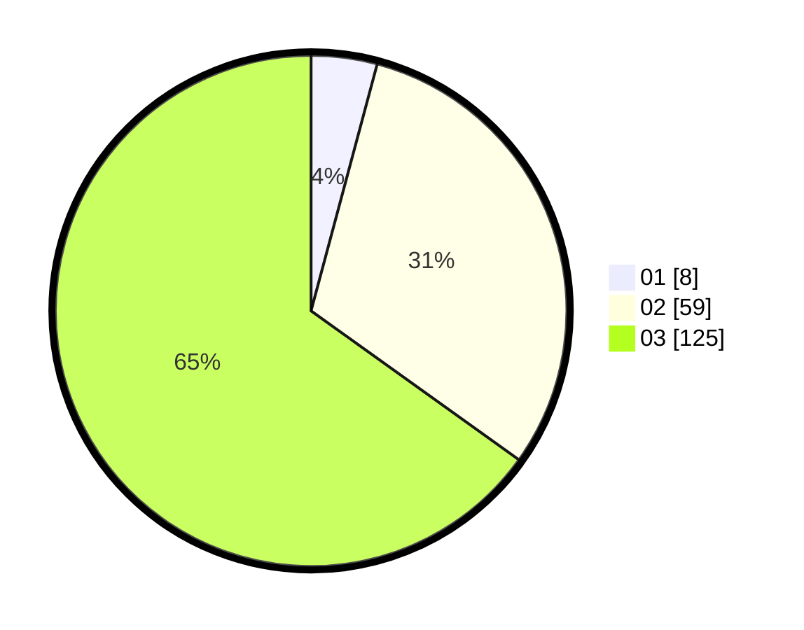

# Hasil

Hasil perolehan suara paslon dapat dilihat pada file paslon-01.txt, paslon-02.txt, dan paslon-03.txt.

Jika tidak ada, artinya data tersebut belum ada pada SIREKAP.

## Perolehan Suara

 * Paslon 01: **8**.
 * Paslon 02: **59**.
 * Paslon 03: **125**.

## Foto C Plano

https://sirekap-obj-formc.kpu.go.id/dada/pemilu/ppwp/31/72/01/10/05/3172011005054-20240217-143158--8007db4a-dbf5-4ecb-ba97-3728d395c401.jpg

https://sirekap-obj-formc.kpu.go.id/dada/pemilu/ppwp/31/72/01/10/05/3172011005054-20240217-143229--fa787321-1351-4ddb-9d15-b329d66cfd89.jpg

https://sirekap-obj-formc.kpu.go.id/dada/pemilu/ppwp/31/72/01/10/05/3172011005054-20240217-143258--db76cd58-6c3f-4a26-819d-ae6790c14d45.jpg

## DATA PEMILIH TETAP

Jumlah pemilih dalam DPT: **286**.
 * L: **129**.
 * P: **157**.

## DATA PENGGUNA HAK PILIH

Jumlah pengguna hak pilih dalam DPT: **189**.
 * L: **84**.
 * P: **105**.

Jumlah pengguna hak pilih dalam DPTb: **8**.
 * L: **5**.
 * P: **3**.

Jumlah pengguna hak pilih dalam DPK: **5**.
 * L: **1**.
 * P: **4**.

Jumlah pengguna hak pilih: **202**.
 * L: **90**.
 * P: **112**.

## JUMLAH SUARA SAH DAN TIDAK SAH

JUMLAH SELURUH SUARA SAH: **202**.

JUMLAH SUARA TIDAK SAH: **0**.

JUMLAH SELURUH SUARA SAH DAN SUARA TIDAK SAH: **202**.
