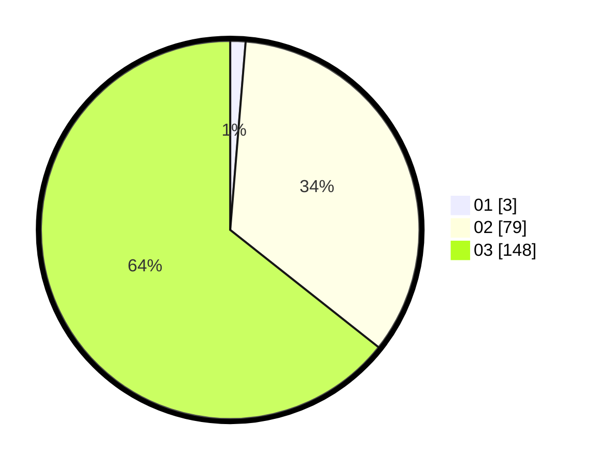

# Hasil

Hasil perolehan suara paslon dapat dilihat pada file paslon-01.txt, paslon-02.txt, dan paslon-03.txt.

Jika tidak ada, artinya data tersebut belum ada pada SIREKAP.

## Perolehan Suara

 * Paslon 01: **3**.
 * Paslon 02: **79**.
 * Paslon 03: **148**.

## Foto C Plano

https://sirekap-obj-formc.kpu.go.id/a407/pemilu/ppwp/31/72/01/10/05/3172011005107-20240214-190100--5577f9fd-7046-4129-b77c-5775ffeef3d5.jpg

https://sirekap-obj-formc.kpu.go.id/a407/pemilu/ppwp/31/72/01/10/05/3172011005107-20240214-190137--9abd8342-8a49-4446-8b16-560cfe412c0f.jpg
