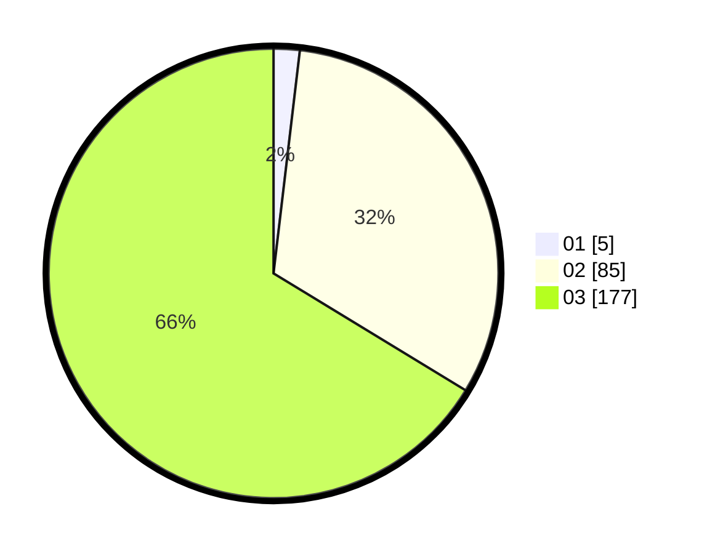

# Hasil

Hasil perolehan suara paslon dapat dilihat pada file paslon-01.txt, paslon-02.txt, dan paslon-03.txt.

Jika tidak ada, artinya data tersebut belum ada pada SIREKAP.

## Perolehan Suara

 * Paslon 01: **5**.
 * Paslon 02: **85**.
 * Paslon 03: **177**.

## Foto C Plano

https://sirekap-obj-formc.kpu.go.id/1fcf/pemilu/ppwp/31/72/01/10/05/3172011005112-20240214-203007--67d03cc7-c73b-4df3-b3b4-a71f61453c65.jpg

https://sirekap-obj-formc.kpu.go.id/1fcf/pemilu/ppwp/31/72/01/10/05/3172011005112-20240214-202507--fac09686-cd52-4af4-b21b-55e795500a67.jpg

https://sirekap-obj-formc.kpu.go.id/1fcf/pemilu/ppwp/31/72/01/10/05/3172011005112-20240214-202321--9f538b3b-656d-496f-9744-44c36b39b7ca.jpg

## DATA PEMILIH TETAP

Jumlah pemilih dalam DPT: **267**.
 * L: **122**.
 * P: **145**.

## DATA PENGGUNA HAK PILIH

Jumlah pengguna hak pilih dalam DPT: **276**.
 * L: **81**.
 * P: **95**.

Jumlah pengguna hak pilih dalam DPTb: **18**.
 * L: **8**.
 * P: **10**.

Jumlah pengguna hak pilih dalam DPK: **10**.
 * L: **5**.
 * P: **5**.

Jumlah pengguna hak pilih: **204**.
 * L: **94**.
 * P: **110**.

## JUMLAH SUARA SAH DAN TIDAK SAH

JUMLAH SELURUH SUARA SAH: **203**.

JUMLAH SUARA TIDAK SAH: **1**.

JUMLAH SELURUH SUARA SAH DAN SUARA TIDAK SAH: **204**.
