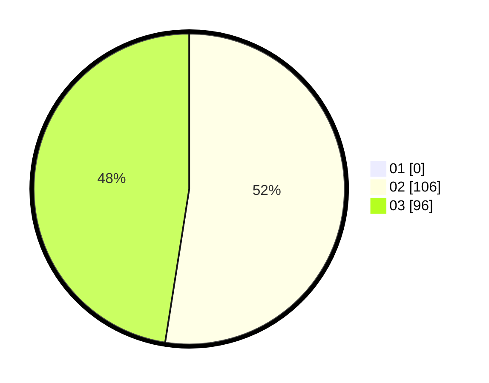

# Hasil

Hasil perolehan suara paslon dapat dilihat pada file paslon-01.txt, paslon-02.txt, dan paslon-03.txt.

Jika tidak ada, artinya data tersebut belum ada pada SIREKAP.

## Perolehan Suara

 * Paslon 01: **0**.
 * Paslon 02: **106**.
 * Paslon 03: **96**.

## Foto C Plano

https://sirekap-obj-formc.kpu.go.id/7cb0/pemilu/ppwp/31/72/01/10/05/3172011005129-20240214-155707--5a1c05f8-163d-4d18-88d8-51ff3fea2090.jpg

https://sirekap-obj-formc.kpu.go.id/7cb0/pemilu/ppwp/31/72/01/10/05/3172011005129-20240214-155748--d1cbdab8-9f4e-4147-9ad3-4d3826917ba5.jpg

https://sirekap-obj-formc.kpu.go.id/7cb0/pemilu/ppwp/31/72/01/10/05/3172011005129-20240214-155547--ce97a3c8-a9b1-40ba-a79c-6f09a72a2939.jpg

## DATA PEMILIH TETAP

Jumlah pemilih dalam DPT: **264**.
 * L: **126**.
 * P: **138**.

## DATA PENGGUNA HAK PILIH

Jumlah pengguna hak pilih dalam DPT: **194**.
 * L: **89**.
 * P: **105**.

Jumlah pengguna hak pilih dalam DPTb: **9**.
 * L: **2**.
 * P: **7**.

Jumlah pengguna hak pilih dalam DPK: **1**.
 * L: **0**.
 * P: **1**.

Jumlah pengguna hak pilih: **204**.
 * L: **91**.
 * P: **113**.

## JUMLAH SUARA SAH DAN TIDAK SAH

JUMLAH SELURUH SUARA SAH: **202**.

JUMLAH SUARA TIDAK SAH: **2**.

JUMLAH SELURUH SUARA SAH DAN SUARA TIDAK SAH: **204**.
