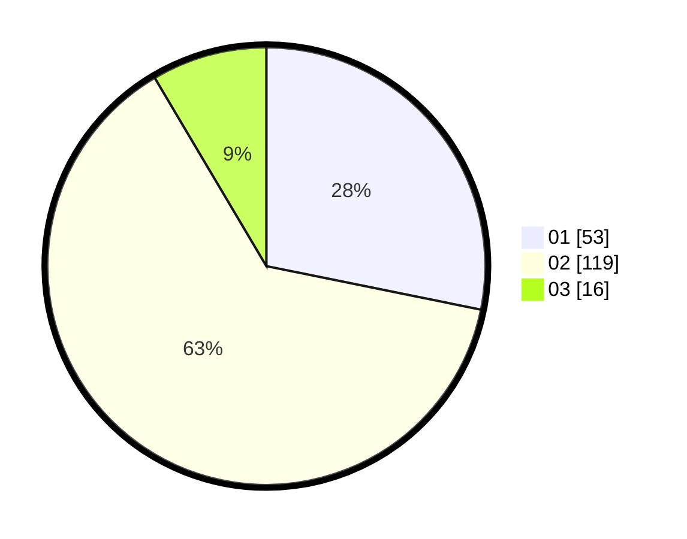

# Hasil

Hasil perolehan suara paslon dapat dilihat pada file paslon-01.txt, paslon-02.txt, dan paslon-03.txt.

Jika tidak ada, artinya data tersebut belum ada pada SIREKAP.

## Perolehan Suara

 * Paslon 01: **53**.
 * Paslon 02: **119**.
 * Paslon 03: **16**.

## Foto C Plano

https://sirekap-obj-formc.kpu.go.id/3235/pemilu/ppwp/31/72/01/10/05/3172011005142-20240214-155231--b1d67a84-78c3-460d-bb49-20878f6eb42b.jpg

https://sirekap-obj-formc.kpu.go.id/3235/pemilu/ppwp/31/72/01/10/05/3172011005142-20240214-155348--ba9f9505-d230-4b72-ba38-348ca959b09c.jpg

https://sirekap-obj-formc.kpu.go.id/3235/pemilu/ppwp/31/72/01/10/05/3172011005142-20240214-155405--b93c2ac7-d3d6-4c09-b633-8934d8e0cfac.jpg

## DATA PEMILIH TETAP

Jumlah pemilih dalam DPT: **261**.
 * L: **136**.
 * P: **125**.

## DATA PENGGUNA HAK PILIH

Jumlah pengguna hak pilih dalam DPT: **193**.
 * L: **98**.
 * P: **95**.

Jumlah pengguna hak pilih dalam DPTb: **0**.
 * L: **0**.
 * P: **0**.

Jumlah pengguna hak pilih dalam DPK: **1**.
 * L: **0**.
 * P: **1**.

Jumlah pengguna hak pilih: **194**.
 * L: **98**.
 * P: **96**.

## JUMLAH SUARA SAH DAN TIDAK SAH

JUMLAH SELURUH SUARA SAH: **188**.

JUMLAH SUARA TIDAK SAH: **6**.

JUMLAH SELURUH SUARA SAH DAN SUARA TIDAK SAH: **194**.
