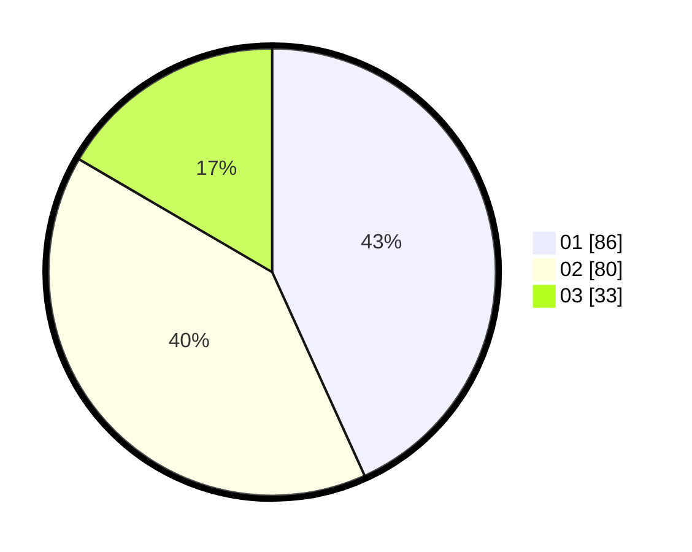

# Hasil

Hasil perolehan suara paslon dapat dilihat pada file paslon-01.txt, paslon-02.txt, dan paslon-03.txt.

Jika tidak ada, artinya data tersebut belum ada pada SIREKAP.

## Perolehan Suara

 * Paslon 01: **86**.
 * Paslon 02: **80**.
 * Paslon 03: **33**.

## Foto C Plano

https://sirekap-obj-formc.kpu.go.id/01b6/pemilu/ppwp/31/72/02/10/01/3172021001005-20240215-044558--74a54a32-72fe-4b10-8779-0f5038f0490f.jpg

https://sirekap-obj-formc.kpu.go.id/01b6/pemilu/ppwp/31/72/02/10/01/3172021001005-20240215-033917--9f6e7a2e-01cb-4e9b-adfb-7cf38acb779b.jpg

https://sirekap-obj-formc.kpu.go.id/01b6/pemilu/ppwp/31/72/02/10/01/3172021001005-20240215-023933--54af0e76-98d4-4b3e-9c6c-4d273efd6c11.jpg
