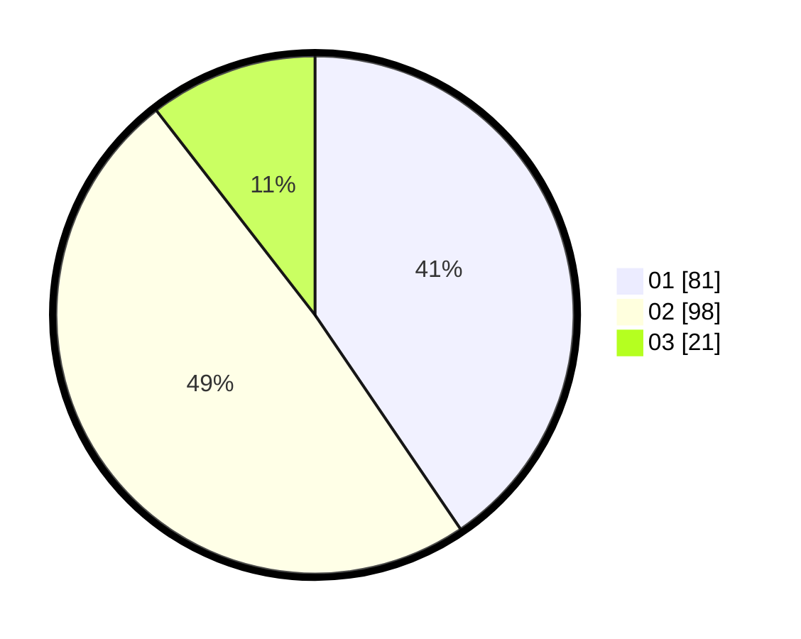

# Hasil

Hasil perolehan suara paslon dapat dilihat pada file paslon-01.txt, paslon-02.txt, dan paslon-03.txt.

Jika tidak ada, artinya data tersebut belum ada pada SIREKAP.

## Perolehan Suara

 * Paslon 01: **81**.
 * Paslon 02: **98**.
 * Paslon 03: **21**.

## Foto C Plano

https://sirekap-obj-formc.kpu.go.id/7aef/pemilu/ppwp/31/72/02/10/01/3172021001006-20240215-023513--61709167-c4e1-4fb3-83e0-44276a8a3f80.jpg

https://sirekap-obj-formc.kpu.go.id/7aef/pemilu/ppwp/31/72/02/10/01/3172021001006-20240215-023637--87aea969-aa4e-45db-9d10-2a92c770158e.jpg

https://sirekap-obj-formc.kpu.go.id/7aef/pemilu/ppwp/31/72/02/10/01/3172021001006-20240215-023801--673990b3-a4eb-4c2b-bce1-0c10b1b71252.jpg
