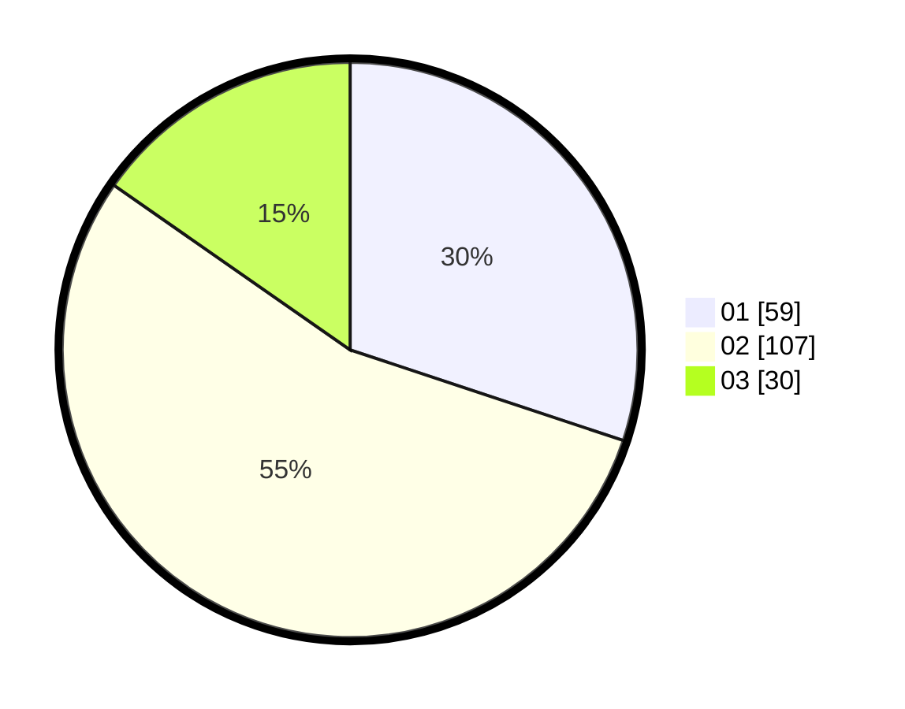

# Hasil

Hasil perolehan suara paslon dapat dilihat pada file paslon-01.txt, paslon-02.txt, dan paslon-03.txt.

Jika tidak ada, artinya data tersebut belum ada pada SIREKAP.

## Perolehan Suara

 * Paslon 01: **59**.
 * Paslon 02: **107**.
 * Paslon 03: **30**.

## Foto C Plano

https://sirekap-obj-formc.kpu.go.id/999b/pemilu/ppwp/31/72/02/10/01/3172021001008-20240214-222658--1ff304a1-cf84-474c-b102-f1d021618aa0.jpg

https://sirekap-obj-formc.kpu.go.id/999b/pemilu/ppwp/31/72/02/10/01/3172021001008-20240214-222829--26d51f46-94bb-4c94-b304-eca0c80327b7.jpg
