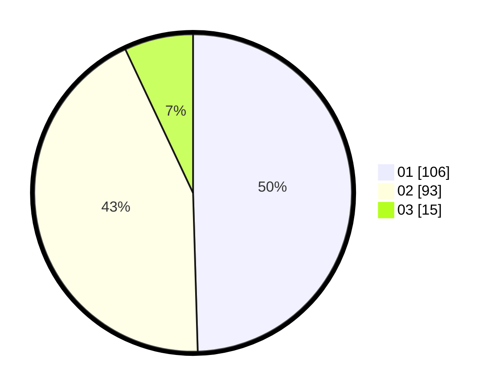

# Hasil

Hasil perolehan suara paslon dapat dilihat pada file paslon-01.txt, paslon-02.txt, dan paslon-03.txt.

Jika tidak ada, artinya data tersebut belum ada pada SIREKAP.

## Perolehan Suara

 * Paslon 01: **106**.
 * Paslon 02: **93**.
 * Paslon 03: **15**.

## Foto C Plano

https://sirekap-obj-formc.kpu.go.id/20ef/pemilu/ppwp/31/72/02/10/01/3172021001009-20240215-030400--db6da540-f200-4fc5-8612-30052b069e2d.jpg

https://sirekap-obj-formc.kpu.go.id/20ef/pemilu/ppwp/31/72/02/10/01/3172021001009-20240215-030633--8e194cda-8453-4f71-b5bc-4a0d9b1df1e6.jpg

https://sirekap-obj-formc.kpu.go.id/20ef/pemilu/ppwp/31/72/02/10/01/3172021001009-20240215-031119--1f0029e4-6d4d-470b-ace5-6705cb39242c.jpg
