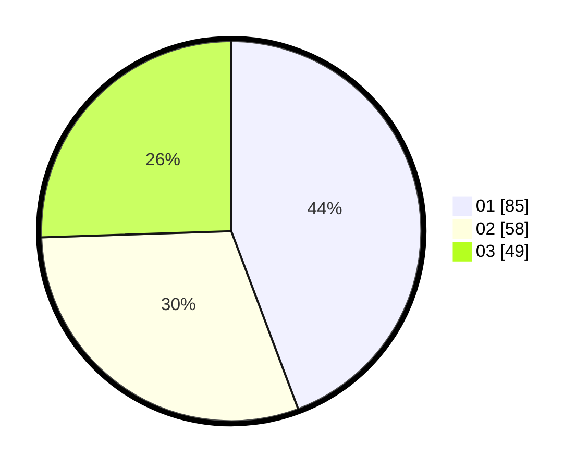

# Hasil

Hasil perolehan suara paslon dapat dilihat pada file paslon-01.txt, paslon-02.txt, dan paslon-03.txt.

Jika tidak ada, artinya data tersebut belum ada pada SIREKAP.

## Perolehan Suara

 * Paslon 01: **85**.
 * Paslon 02: **58**.
 * Paslon 03: **49**.

## Foto C Plano

https://sirekap-obj-formc.kpu.go.id/cda8/pemilu/ppwp/31/72/02/10/01/3172021001011-20240215-160945--1ef2fa9a-f355-4051-aa2c-53c08f876a7c.jpg

https://sirekap-obj-formc.kpu.go.id/cda8/pemilu/ppwp/31/72/02/10/01/3172021001011-20240215-122501--d6027e45-ac7a-4a35-b026-fc7d5cefa5ad.jpg

https://sirekap-obj-formc.kpu.go.id/cda8/pemilu/ppwp/31/72/02/10/01/3172021001011-20240215-122607--a4533222-0721-49fc-b094-f7b80aeba347.jpg
