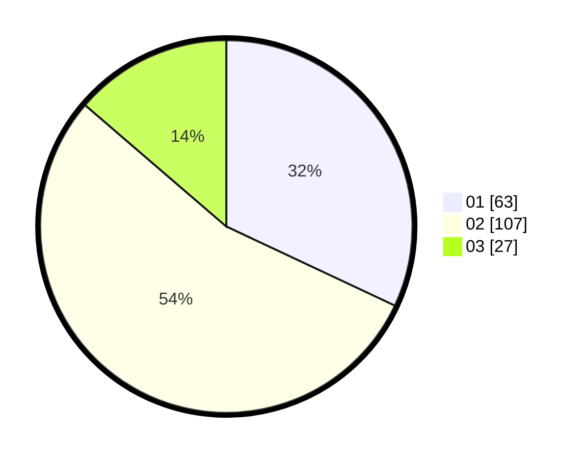

# Hasil

Hasil perolehan suara paslon dapat dilihat pada file paslon-01.txt, paslon-02.txt, dan paslon-03.txt.

Jika tidak ada, artinya data tersebut belum ada pada SIREKAP.

## Perolehan Suara

 * Paslon 01: **63**.
 * Paslon 02: **107**.
 * Paslon 03: **27**.

## Foto C Plano

https://sirekap-obj-formc.kpu.go.id/e896/pemilu/ppwp/31/72/02/10/01/3172021001013-20240214-203927--f4bef73f-3020-4a04-92b9-2f276f271c05.jpg

https://sirekap-obj-formc.kpu.go.id/e896/pemilu/ppwp/31/72/02/10/01/3172021001013-20240214-203949--fcbb9a1c-31a3-4b13-80d6-5924229a66e3.jpg

https://sirekap-obj-formc.kpu.go.id/e896/pemilu/ppwp/31/72/02/10/01/3172021001013-20240214-204007--5c6eac75-2ab9-4091-92f6-fb9206456894.jpg
