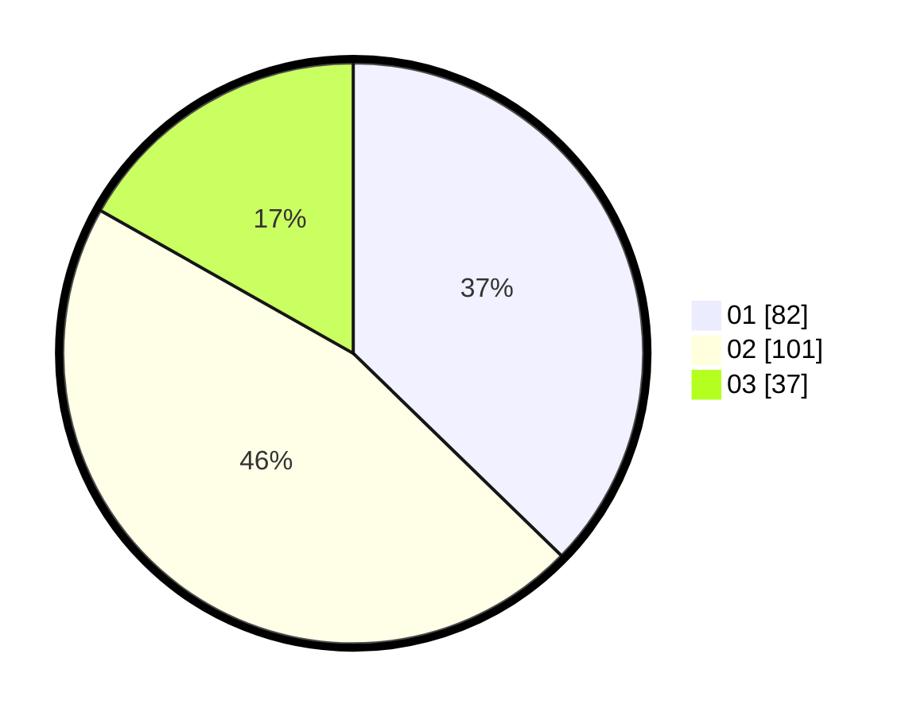

# Hasil

Hasil perolehan suara paslon dapat dilihat pada file paslon-01.txt, paslon-02.txt, dan paslon-03.txt.

Jika tidak ada, artinya data tersebut belum ada pada SIREKAP.

## Perolehan Suara

 * Paslon 01: **82**.
 * Paslon 02: **101**.
 * Paslon 03: **37**.

## Foto C Plano

https://sirekap-obj-formc.kpu.go.id/c4f2/pemilu/ppwp/31/72/02/10/01/3172021001015-20240214-223546--476b2eea-fd80-4b8d-8c44-7de1bddb436b.jpg

https://sirekap-obj-formc.kpu.go.id/c4f2/pemilu/ppwp/31/72/02/10/01/3172021001015-20240214-223727--1d2cbd6c-4703-4009-b705-67da893abbca.jpg

https://sirekap-obj-formc.kpu.go.id/c4f2/pemilu/ppwp/31/72/02/10/01/3172021001015-20240214-223757--e6ba7cfd-f4a9-4b11-8463-42a2d501dd63.jpg
