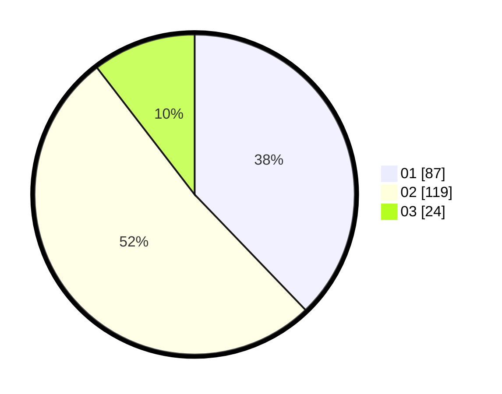

# Hasil

Hasil perolehan suara paslon dapat dilihat pada file paslon-01.txt, paslon-02.txt, dan paslon-03.txt.

Jika tidak ada, artinya data tersebut belum ada pada SIREKAP.

## Perolehan Suara

 * Paslon 01: **87**.
 * Paslon 02: **119**.
 * Paslon 03: **24**.

## Foto C Plano

https://sirekap-obj-formc.kpu.go.id/a545/pemilu/ppwp/31/72/02/10/01/3172021001016-20240215-032811--ada97321-79d2-4de9-bedf-46c02add5ee4.jpg

https://sirekap-obj-formc.kpu.go.id/a545/pemilu/ppwp/31/72/02/10/01/3172021001016-20240215-034852--dfd2d8b0-f14b-4c04-85bc-f0be80d76d80.jpg
