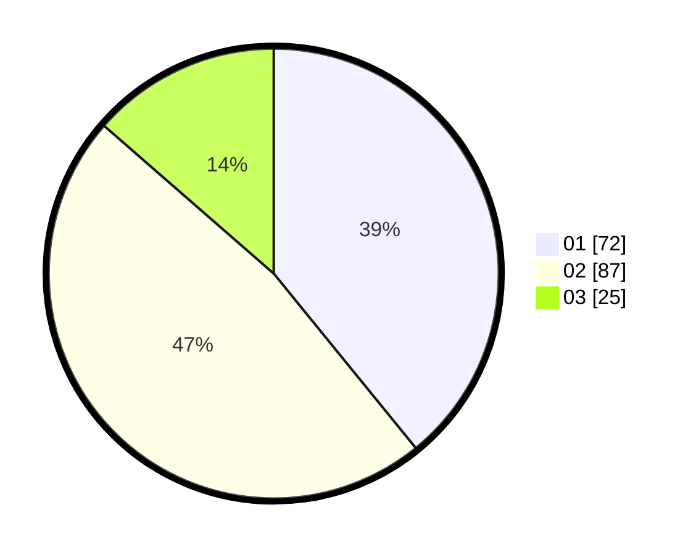

# Hasil

Hasil perolehan suara paslon dapat dilihat pada file paslon-01.txt, paslon-02.txt, dan paslon-03.txt.

Jika tidak ada, artinya data tersebut belum ada pada SIREKAP.

## Perolehan Suara

 * Paslon 01: **72**.
 * Paslon 02: **87**.
 * Paslon 03: **25**.

## Foto C Plano

https://sirekap-obj-formc.kpu.go.id/066d/pemilu/ppwp/31/72/02/10/01/3172021001017-20240217-233625--72372d10-15c4-4d3d-a9f5-b748809fcdbc.jpg

https://sirekap-obj-formc.kpu.go.id/066d/pemilu/ppwp/31/72/02/10/01/3172021001017-20240214-202801--8315eb78-68ad-4fb2-817a-39058cac653f.jpg

https://sirekap-obj-formc.kpu.go.id/066d/pemilu/ppwp/31/72/02/10/01/3172021001017-20240214-202850--fee3b503-5a0a-49db-9906-f89c889c92d7.jpg
