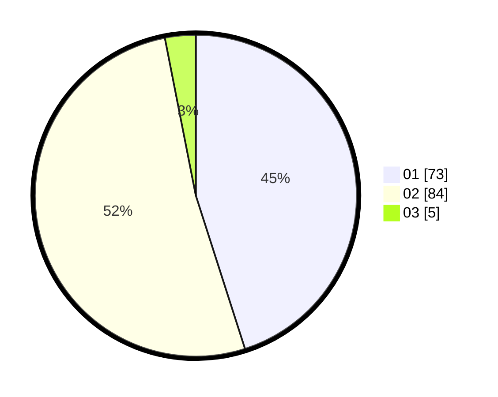

# Hasil

Hasil perolehan suara paslon dapat dilihat pada file paslon-01.txt, paslon-02.txt, dan paslon-03.txt.

Jika tidak ada, artinya data tersebut belum ada pada SIREKAP.

## Perolehan Suara

 * Paslon 01: **73**.
 * Paslon 02: **84**.
 * Paslon 03: **5**.

## Foto C Plano

https://sirekap-obj-formc.kpu.go.id/fca7/pemilu/ppwp/31/72/02/10/01/3172021001019-20240215-063824--10c78aca-84cd-445c-8580-fe35b908e813.jpg

https://sirekap-obj-formc.kpu.go.id/fca7/pemilu/ppwp/31/72/02/10/01/3172021001019-20240215-063845--0f1bee85-f78f-4346-9967-2b1299f75303.jpg

https://sirekap-obj-formc.kpu.go.id/fca7/pemilu/ppwp/31/72/02/10/01/3172021001019-20240215-063834--bd239bc8-162f-4673-a26a-672a67993e53.jpg

## DATA PEMILIH TETAP

Jumlah pemilih dalam DPT: **205**.
 * L: **101**.
 * P: **104**.

## DATA PENGGUNA HAK PILIH

Jumlah pengguna hak pilih dalam DPT: **161**.
 * L: **81**.
 * P: **80**.

Jumlah pengguna hak pilih dalam DPTb: **0**.
 * L: **0**.
 * P: **0**.

Jumlah pengguna hak pilih dalam DPK: **3**.
 * L: **1**.
 * P: **2**.

Jumlah pengguna hak pilih: **164**.
 * L: **82**.
 * P: **82**.

## JUMLAH SUARA SAH DAN TIDAK SAH

JUMLAH SELURUH SUARA SAH: **162**.

JUMLAH SUARA TIDAK SAH: **2**.

JUMLAH SELURUH SUARA SAH DAN SUARA TIDAK SAH: **164**.
