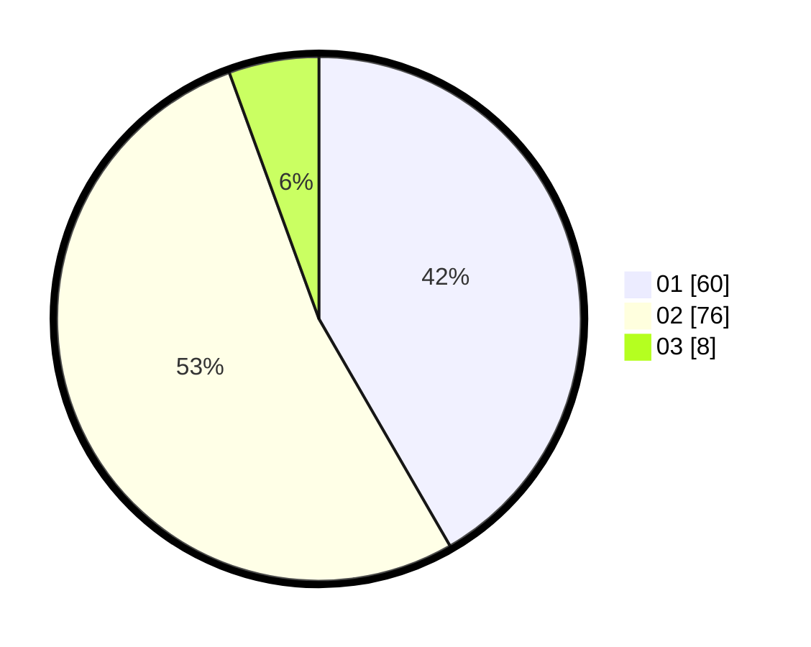

# Hasil

Hasil perolehan suara paslon dapat dilihat pada file paslon-01.txt, paslon-02.txt, dan paslon-03.txt.

Jika tidak ada, artinya data tersebut belum ada pada SIREKAP.

## Perolehan Suara

 * Paslon 01: **60**.
 * Paslon 02: **76**.
 * Paslon 03: **8**.

## Foto C Plano

https://sirekap-obj-formc.kpu.go.id/0980/pemilu/ppwp/31/72/02/10/01/3172021001027-20240214-211336--42bdae35-4d5e-43ec-ba5c-23a9441993d2.jpg

https://sirekap-obj-formc.kpu.go.id/0980/pemilu/ppwp/31/72/02/10/01/3172021001027-20240214-211419--c21d954e-1eea-4eae-99c6-839c8777beb5.jpg
