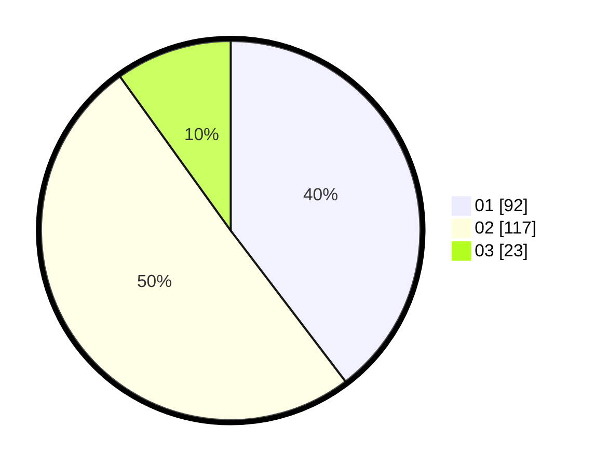

# Hasil

Hasil perolehan suara paslon dapat dilihat pada file paslon-01.txt, paslon-02.txt, dan paslon-03.txt.

Jika tidak ada, artinya data tersebut belum ada pada SIREKAP.

## Perolehan Suara

 * Paslon 01: **92**.
 * Paslon 02: **117**.
 * Paslon 03: **23**.

## Foto C Plano

https://sirekap-obj-formc.kpu.go.id/be7f/pemilu/ppwp/31/72/02/10/01/3172021001040-20240214-202438--37910978-4f1d-4cce-980b-5bb29e1c1e01.jpg

https://sirekap-obj-formc.kpu.go.id/be7f/pemilu/ppwp/31/72/02/10/01/3172021001040-20240214-202855--73351d40-665f-4680-a782-cf0c547744ff.jpg

https://sirekap-obj-formc.kpu.go.id/be7f/pemilu/ppwp/31/72/02/10/01/3172021001040-20240214-202759--23302876-7f76-4634-b820-9d820b4d1f87.jpg

## DATA PEMILIH TETAP

Jumlah pemilih dalam DPT: **231**.
 * L: **106**.
 * P: **125**.

## DATA PENGGUNA HAK PILIH

Jumlah pengguna hak pilih dalam DPT: **231**.
 * L: **106**.
 * P: **125**.

Jumlah pengguna hak pilih dalam DPTb: **2**.
 * L: **1**.
 * P: **1**.

Jumlah pengguna hak pilih dalam DPK: **1**.
 * L: **1**.
 * P: **0**.

Jumlah pengguna hak pilih: **234**.
 * L: **108**.
 * P: **126**.

## JUMLAH SUARA SAH DAN TIDAK SAH

JUMLAH SELURUH SUARA SAH: **232**.

JUMLAH SUARA TIDAK SAH: **2**.

JUMLAH SELURUH SUARA SAH DAN SUARA TIDAK SAH: **234**.
