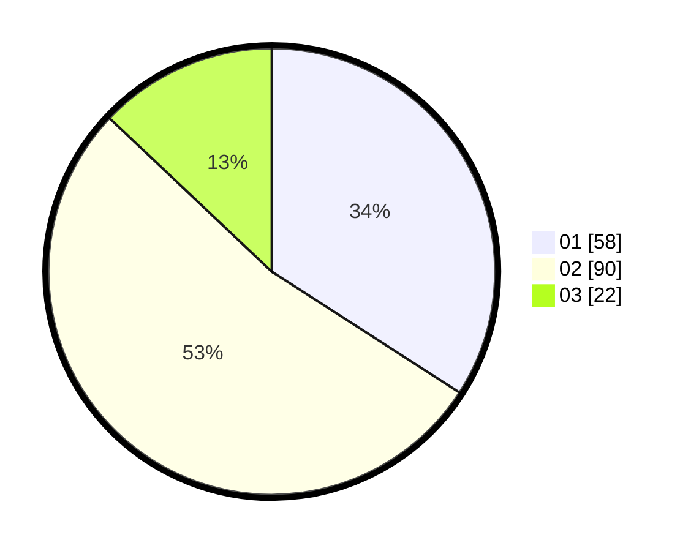

# Hasil

Hasil perolehan suara paslon dapat dilihat pada file paslon-01.txt, paslon-02.txt, dan paslon-03.txt.

Jika tidak ada, artinya data tersebut belum ada pada SIREKAP.

## Perolehan Suara

 * Paslon 01: **58**.
 * Paslon 02: **90**.
 * Paslon 03: **22**.

## Foto C Plano

https://sirekap-obj-formc.kpu.go.id/f716/pemilu/ppwp/31/72/02/10/01/3172021001047-20240214-212814--5f2e932b-8db1-4650-b292-59e918d96b62.jpg

https://sirekap-obj-formc.kpu.go.id/f716/pemilu/ppwp/31/72/02/10/01/3172021001047-20240214-213124--b8965fc9-0f1b-4d66-9160-66ee867c3ea9.jpg

https://sirekap-obj-formc.kpu.go.id/f716/pemilu/ppwp/31/72/02/10/01/3172021001047-20240214-213227--eae39bda-330c-4d1b-aeeb-68010ccc7276.jpg
