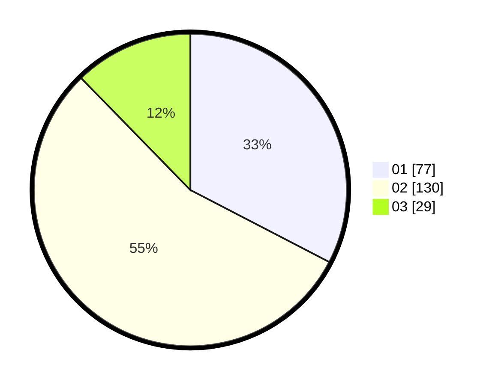

# Hasil

Hasil perolehan suara paslon dapat dilihat pada file paslon-01.txt, paslon-02.txt, dan paslon-03.txt.

Jika tidak ada, artinya data tersebut belum ada pada SIREKAP.

## Perolehan Suara

 * Paslon 01: **77**.
 * Paslon 02: **130**.
 * Paslon 03: **29**.

## Foto C Plano

https://sirekap-obj-formc.kpu.go.id/2d1b/pemilu/ppwp/31/72/02/10/01/3172021001058-20240215-104940--ec099ac1-41e9-4a31-b063-351deec0301b.jpg

https://sirekap-obj-formc.kpu.go.id/2d1b/pemilu/ppwp/31/72/02/10/01/3172021001058-20240215-104954--3867b196-5bbd-4ca2-b484-e7316ccfbb38.jpg

https://sirekap-obj-formc.kpu.go.id/2d1b/pemilu/ppwp/31/72/02/10/01/3172021001058-20240215-104959--2f99a1ef-382b-4d0a-b65e-10b0f0c6a571.jpg
