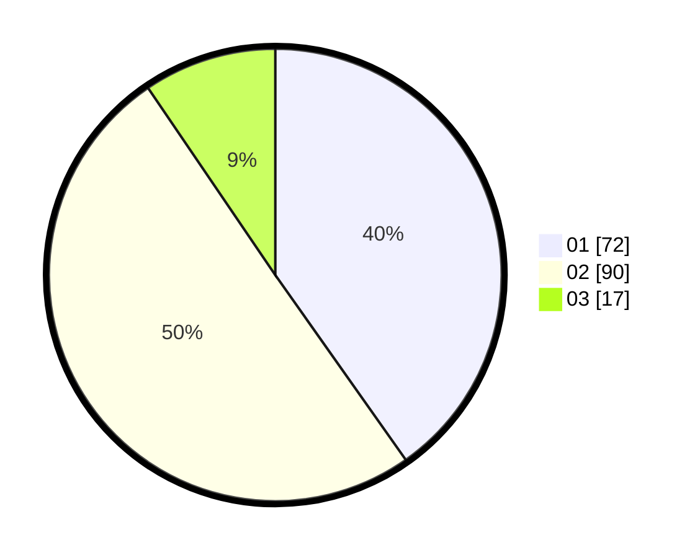

# Hasil

Hasil perolehan suara paslon dapat dilihat pada file paslon-01.txt, paslon-02.txt, dan paslon-03.txt.

Jika tidak ada, artinya data tersebut belum ada pada SIREKAP.

## Perolehan Suara

 * Paslon 01: **72**.
 * Paslon 02: **90**.
 * Paslon 03: **17**.

## Foto C Plano

https://sirekap-obj-formc.kpu.go.id/8075/pemilu/ppwp/31/72/02/10/01/3172021001063-20240214-155229--1df1d61f-f8c2-4b54-90ee-162acfb80308.jpg

https://sirekap-obj-formc.kpu.go.id/8075/pemilu/ppwp/31/72/02/10/01/3172021001063-20240214-185316--ff1ae7d2-50b0-4ff0-8a2c-72c42dd04a65.jpg

https://sirekap-obj-formc.kpu.go.id/8075/pemilu/ppwp/31/72/02/10/01/3172021001063-20240214-185340--3615c682-88be-4b7b-a656-6e9c4edcf5cd.jpg

## DATA PEMILIH TETAP

Jumlah pemilih dalam DPT: **287**.
 * L: **145**.
 * P: **142**.

## DATA PENGGUNA HAK PILIH

Jumlah pengguna hak pilih dalam DPT: **188**.
 * L: **84**.
 * P: **104**.

Jumlah pengguna hak pilih dalam DPTb: **0**.
 * L: **0**.
 * P: **0**.

Jumlah pengguna hak pilih dalam DPK: **0**.
 * L: **0**.
 * P: **0**.

Jumlah pengguna hak pilih: **188**.
 * L: **84**.
 * P: **104**.

## JUMLAH SUARA SAH DAN TIDAK SAH

JUMLAH SELURUH SUARA SAH: **179**.

JUMLAH SUARA TIDAK SAH: **9**.

JUMLAH SELURUH SUARA SAH DAN SUARA TIDAK SAH: **188**.
