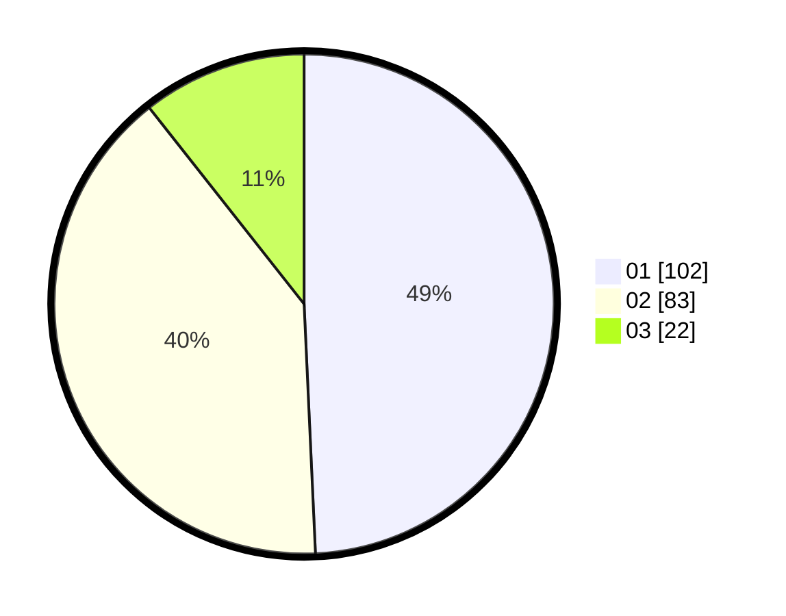

# Hasil

Hasil perolehan suara paslon dapat dilihat pada file paslon-01.txt, paslon-02.txt, dan paslon-03.txt.

Jika tidak ada, artinya data tersebut belum ada pada SIREKAP.

## Perolehan Suara

 * Paslon 01: **102**.
 * Paslon 02: **83**.
 * Paslon 03: **22**.

## Foto C Plano

https://sirekap-obj-formc.kpu.go.id/eaae/pemilu/ppwp/31/72/02/10/01/3172021001064-20240214-185205--3069776e-5b7a-4e1c-8cc6-a63dbc6314f0.jpg

https://sirekap-obj-formc.kpu.go.id/eaae/pemilu/ppwp/31/72/02/10/01/3172021001064-20240214-190906--020d77f5-886e-4ec4-a93d-59c8372ce324.jpg

https://sirekap-obj-formc.kpu.go.id/eaae/pemilu/ppwp/31/72/02/10/01/3172021001064-20240214-190030--01c90343-620c-4f2e-85d5-1da74de9bd6b.jpg

## DATA PEMILIH TETAP

Jumlah pemilih dalam DPT: **289**.
 * L: **145**.
 * P: **144**.

## DATA PENGGUNA HAK PILIH

Jumlah pengguna hak pilih dalam DPT: **209**.
 * L: **100**.
 * P: **109**.

Jumlah pengguna hak pilih dalam DPTb: **0**.
 * L: **0**.
 * P: **0**.

Jumlah pengguna hak pilih dalam DPK: **1**.
 * L: **1**.
 * P: **0**.

Jumlah pengguna hak pilih: **210**.
 * L: **101**.
 * P: **109**.

## JUMLAH SUARA SAH DAN TIDAK SAH

JUMLAH SELURUH SUARA SAH: **207**.

JUMLAH SUARA TIDAK SAH: **3**.

JUMLAH SELURUH SUARA SAH DAN SUARA TIDAK SAH: **210**.
