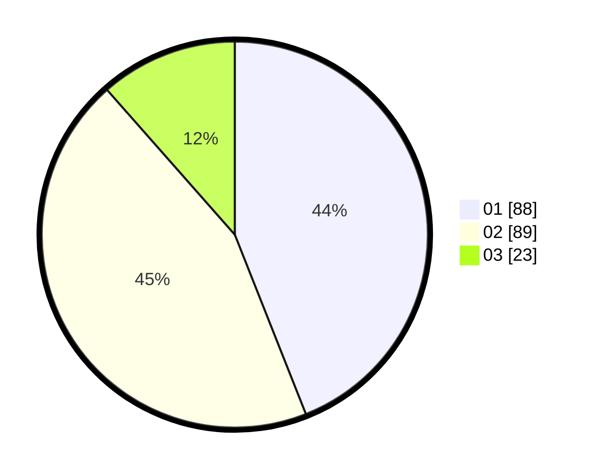

# Hasil

Hasil perolehan suara paslon dapat dilihat pada file paslon-01.txt, paslon-02.txt, dan paslon-03.txt.

Jika tidak ada, artinya data tersebut belum ada pada SIREKAP.

## Perolehan Suara

 * Paslon 01: **88**.
 * Paslon 02: **89**.
 * Paslon 03: **23**.

## Foto C Plano

https://sirekap-obj-formc.kpu.go.id/2523/pemilu/ppwp/31/72/02/10/01/3172021001065-20240216-213622--df1f551d-3e0c-4371-a989-45f1c92df3bb.jpg

https://sirekap-obj-formc.kpu.go.id/2523/pemilu/ppwp/31/72/02/10/01/3172021001065-20240216-231510--efc936ca-791c-421e-b279-0e6123653bc0.jpg

https://sirekap-obj-formc.kpu.go.id/2523/pemilu/ppwp/31/72/02/10/01/3172021001065-20240216-214524--6bb129c8-91f9-4dd5-856e-162b3ebf3261.jpg

## DATA PEMILIH TETAP

Jumlah pemilih dalam DPT: **289**.
 * L: **141**.
 * P: **148**.

## DATA PENGGUNA HAK PILIH

Jumlah pengguna hak pilih dalam DPT: **204**.
 * L: **93**.
 * P: **111**.

Jumlah pengguna hak pilih dalam DPTb: **2**.
 * L: **1**.
 * P: **1**.

Jumlah pengguna hak pilih dalam DPK: **1**.
 * L: **0**.
 * P: **1**.

Jumlah pengguna hak pilih: **207**.
 * L: **94**.
 * P: **113**.

## JUMLAH SUARA SAH DAN TIDAK SAH

JUMLAH SELURUH SUARA SAH: **200**.

JUMLAH SUARA TIDAK SAH: **7**.

JUMLAH SELURUH SUARA SAH DAN SUARA TIDAK SAH: **207**.
