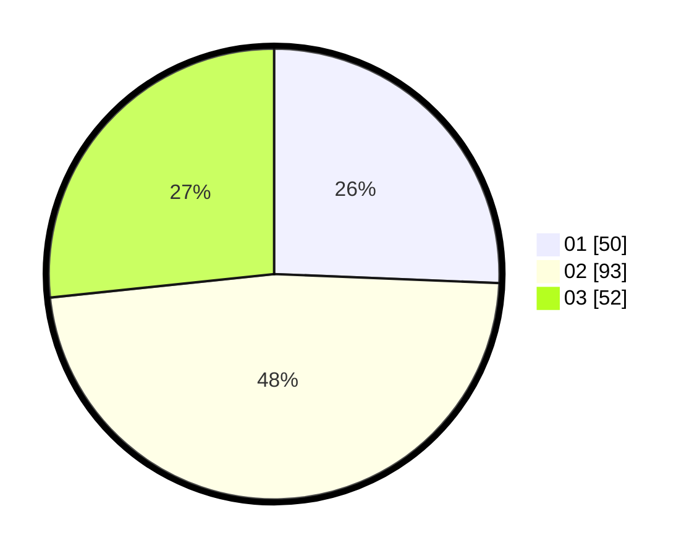

# Hasil

Hasil perolehan suara paslon dapat dilihat pada file paslon-01.txt, paslon-02.txt, dan paslon-03.txt.

Jika tidak ada, artinya data tersebut belum ada pada SIREKAP.

## Perolehan Suara

 * Paslon 01: **50**.
 * Paslon 02: **93**.
 * Paslon 03: **52**.

## Foto C Plano

https://sirekap-obj-formc.kpu.go.id/542b/pemilu/ppwp/31/72/02/10/01/3172021001067-20240216-140058--b5882719-ec54-47af-8bcb-528aaf184aae.jpg

https://sirekap-obj-formc.kpu.go.id/542b/pemilu/ppwp/31/72/02/10/01/3172021001067-20240216-140100--b606ab93-ea8e-426f-ab8a-d61a2aada493.jpg

https://sirekap-obj-formc.kpu.go.id/542b/pemilu/ppwp/31/72/02/10/01/3172021001067-20240216-140059--27fbd00a-61dc-4255-b1a2-4128dc07acdc.jpg

## DATA PEMILIH TETAP

Jumlah pemilih dalam DPT: **288**.
 * L: **142**.
 * P: **146**.

## DATA PENGGUNA HAK PILIH

Jumlah pengguna hak pilih dalam DPT: **194**.
 * L: **96**.
 * P: **98**.

Jumlah pengguna hak pilih dalam DPTb: **0**.
 * L: **0**.
 * P: **0**.

Jumlah pengguna hak pilih dalam DPK: **1**.
 * L: **0**.
 * P: **1**.

Jumlah pengguna hak pilih: **195**.
 * L: **96**.
 * P: **99**.

## JUMLAH SUARA SAH DAN TIDAK SAH

JUMLAH SELURUH SUARA SAH: **195**.

JUMLAH SUARA TIDAK SAH: **0**.

JUMLAH SELURUH SUARA SAH DAN SUARA TIDAK SAH: **195**.
