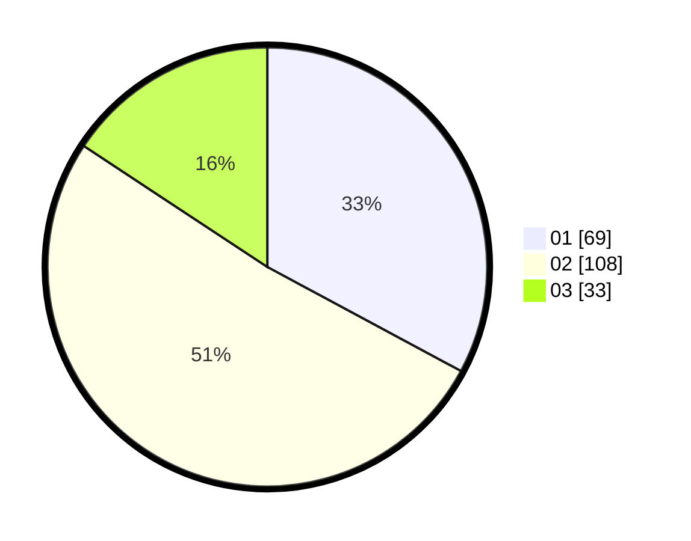

# Hasil

Hasil perolehan suara paslon dapat dilihat pada file paslon-01.txt, paslon-02.txt, dan paslon-03.txt.

Jika tidak ada, artinya data tersebut belum ada pada SIREKAP.

## Perolehan Suara

 * Paslon 01: **69**.
 * Paslon 02: **108**.
 * Paslon 03: **33**.

## Foto C Plano

https://sirekap-obj-formc.kpu.go.id/60ad/pemilu/ppwp/31/72/02/10/01/3172021001075-20240215-023858--3b5c5762-db0c-4e03-ae1a-e0ddfe6a82a4.jpg

https://sirekap-obj-formc.kpu.go.id/60ad/pemilu/ppwp/31/72/02/10/01/3172021001075-20240215-023950--9581fabc-62ee-4c22-b962-3afb46175c8e.jpg

https://sirekap-obj-formc.kpu.go.id/60ad/pemilu/ppwp/31/72/02/10/01/3172021001075-20240215-024047--f3942425-0c9a-4189-a148-94c51ff816ca.jpg

## DATA PEMILIH TETAP

Jumlah pemilih dalam DPT: **262**.
 * L: **130**.
 * P: **132**.

## DATA PENGGUNA HAK PILIH

Jumlah pengguna hak pilih dalam DPT: **201**.
 * L: **91**.
 * P: **110**.

Jumlah pengguna hak pilih dalam DPTb: **6**.
 * L: **4**.
 * P: **2**.

Jumlah pengguna hak pilih dalam DPK: **6**.
 * L: **4**.
 * P: **2**.

Jumlah pengguna hak pilih: **213**.
 * L: **99**.
 * P: **114**.

## JUMLAH SUARA SAH DAN TIDAK SAH

JUMLAH SELURUH SUARA SAH: **210**.

JUMLAH SUARA TIDAK SAH: **3**.

JUMLAH SELURUH SUARA SAH DAN SUARA TIDAK SAH: **213**.
