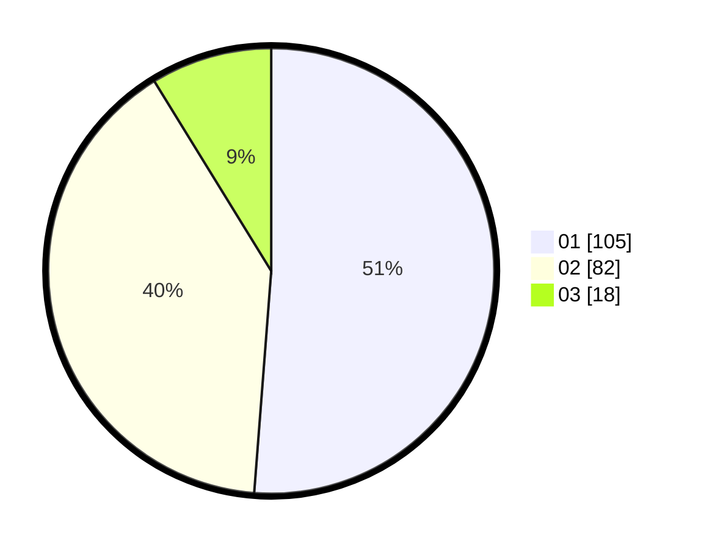

# Hasil

Hasil perolehan suara paslon dapat dilihat pada file paslon-01.txt, paslon-02.txt, dan paslon-03.txt.

Jika tidak ada, artinya data tersebut belum ada pada SIREKAP.

## Perolehan Suara

 * Paslon 01: **105**.
 * Paslon 02: **82**.
 * Paslon 03: **18**.

## Foto C Plano

https://sirekap-obj-formc.kpu.go.id/d329/pemilu/ppwp/31/72/02/10/01/3172021001080-20240214-155326--05a3b80c-520e-47bd-8c7a-070ae629f4ca.jpg

https://sirekap-obj-formc.kpu.go.id/d329/pemilu/ppwp/31/72/02/10/01/3172021001080-20240214-155429--ba7b1dc2-8d49-4454-bebd-54de17fccdae.jpg

https://sirekap-obj-formc.kpu.go.id/d329/pemilu/ppwp/31/72/02/10/01/3172021001080-20240214-160055--305097d7-fa64-48eb-aebb-73cbbc61a6bd.jpg

## DATA PEMILIH TETAP

Jumlah pemilih dalam DPT: **284**.
 * L: **145**.
 * P: **139**.

## DATA PENGGUNA HAK PILIH

Jumlah pengguna hak pilih dalam DPT: **204**.
 * L: **100**.
 * P: **104**.

Jumlah pengguna hak pilih dalam DPTb: **2**.
 * L: **2**.
 * P: **0**.

Jumlah pengguna hak pilih dalam DPK: **0**.
 * L: **0**.
 * P: **0**.

Jumlah pengguna hak pilih: **206**.
 * L: **102**.
 * P: **104**.

## JUMLAH SUARA SAH DAN TIDAK SAH

JUMLAH SELURUH SUARA SAH: **205**.

JUMLAH SUARA TIDAK SAH: **1**.

JUMLAH SELURUH SUARA SAH DAN SUARA TIDAK SAH: **206**.
