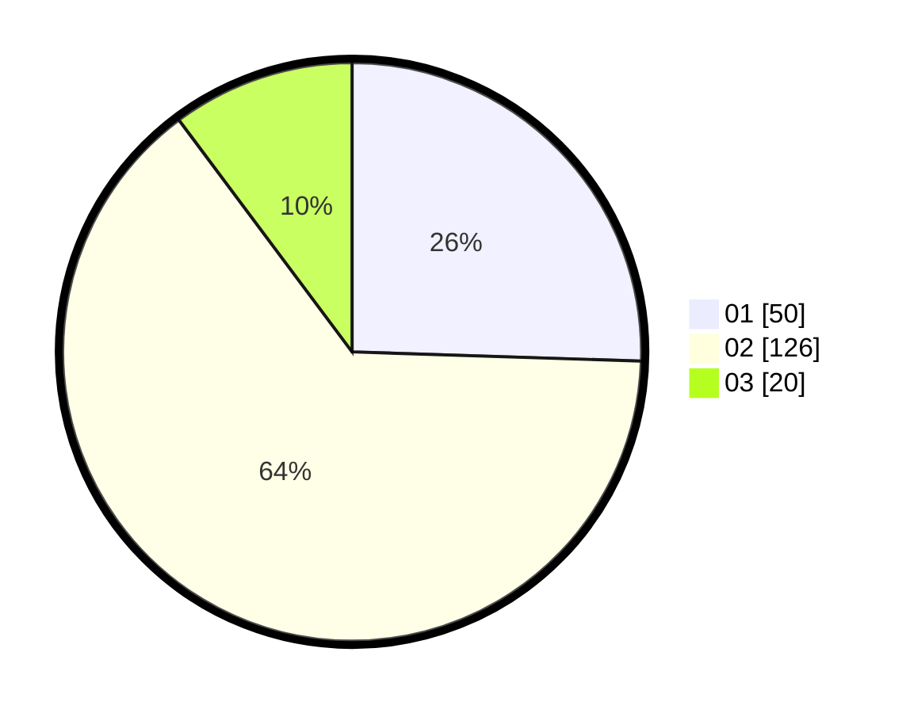

# Hasil

Hasil perolehan suara paslon dapat dilihat pada file paslon-01.txt, paslon-02.txt, dan paslon-03.txt.

Jika tidak ada, artinya data tersebut belum ada pada SIREKAP.

## Perolehan Suara

 * Paslon 01: **50**.
 * Paslon 02: **126**.
 * Paslon 03: **20**.

## Foto C Plano

https://sirekap-obj-formc.kpu.go.id/3e3c/pemilu/ppwp/31/72/02/10/01/3172021001094-20240214-185837--64fbb039-34f1-43c6-b63f-02deac900e5f.jpg

https://sirekap-obj-formc.kpu.go.id/3e3c/pemilu/ppwp/31/72/02/10/01/3172021001094-20240214-190056--29962d16-acdc-4af9-b970-a173297a952e.jpg

https://sirekap-obj-formc.kpu.go.id/3e3c/pemilu/ppwp/31/72/02/10/01/3172021001094-20240214-190128--4d0b030f-38e4-4f74-829f-1bdee4f915fa.jpg
