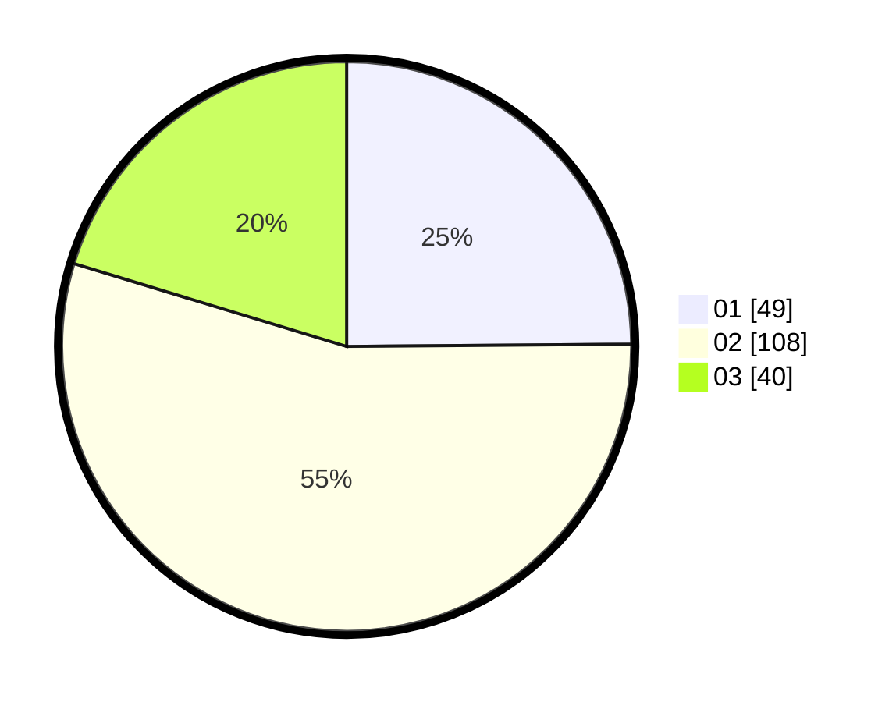

# Hasil

Hasil perolehan suara paslon dapat dilihat pada file paslon-01.txt, paslon-02.txt, dan paslon-03.txt.

Jika tidak ada, artinya data tersebut belum ada pada SIREKAP.

## Perolehan Suara

 * Paslon 01: **49**.
 * Paslon 02: **108**.
 * Paslon 03: **40**.

## Foto C Plano

https://sirekap-obj-formc.kpu.go.id/84b5/pemilu/ppwp/31/72/02/10/01/3172021001107-20240215-003630--dcdc5a17-9d82-41e0-9016-b98e0c9f167b.jpg

https://sirekap-obj-formc.kpu.go.id/84b5/pemilu/ppwp/31/72/02/10/01/3172021001107-20240215-003818--73a0cc35-9c1f-4e40-9eaf-40ea1aba387a.jpg

https://sirekap-obj-formc.kpu.go.id/84b5/pemilu/ppwp/31/72/02/10/01/3172021001107-20240215-003921--cd22815c-e096-4e23-bc03-a9a51d0becf6.jpg

## DATA PEMILIH TETAP

Jumlah pemilih dalam DPT: **288**.
 * L: **147**.
 * P: **141**.

## DATA PENGGUNA HAK PILIH

Jumlah pengguna hak pilih dalam DPT: **199**.
 * L: **99**.
 * P: **100**.

Jumlah pengguna hak pilih dalam DPTb: **0**.
 * L: **0**.
 * P: **0**.

Jumlah pengguna hak pilih dalam DPK: **0**.
 * L: **0**.
 * P: **0**.

Jumlah pengguna hak pilih: **199**.
 * L: **99**.
 * P: **100**.

## JUMLAH SUARA SAH DAN TIDAK SAH

JUMLAH SELURUH SUARA SAH: **197**.

JUMLAH SUARA TIDAK SAH: **2**.

JUMLAH SELURUH SUARA SAH DAN SUARA TIDAK SAH: **199**.
