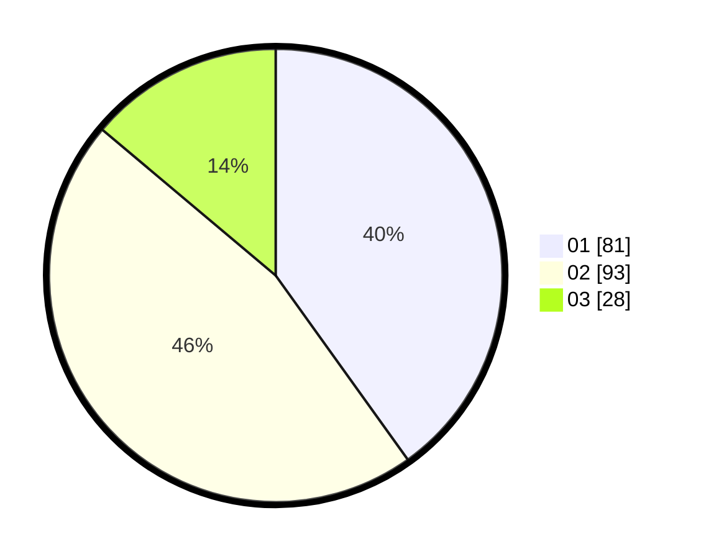

# Hasil

Hasil perolehan suara paslon dapat dilihat pada file paslon-01.txt, paslon-02.txt, dan paslon-03.txt.

Jika tidak ada, artinya data tersebut belum ada pada SIREKAP.

## Perolehan Suara

 * Paslon 01: **81**.
 * Paslon 02: **93**.
 * Paslon 03: **28**.

## Foto C Plano

https://sirekap-obj-formc.kpu.go.id/8731/pemilu/ppwp/31/72/02/10/01/3172021001109-20240214-192233--e7bad014-8a6f-4fea-9b35-85ef2c79e50c.jpg

https://sirekap-obj-formc.kpu.go.id/8731/pemilu/ppwp/31/72/02/10/01/3172021001109-20240214-202005--89d59a1d-05f1-4409-9675-73443c800eb1.jpg

https://sirekap-obj-formc.kpu.go.id/8731/pemilu/ppwp/31/72/02/10/01/3172021001109-20240214-192459--5110c25f-80a9-44be-8e31-c92d5a226b48.jpg

## DATA PEMILIH TETAP

Jumlah pemilih dalam DPT: **289**.
 * L: **144**.
 * P: **145**.

## DATA PENGGUNA HAK PILIH

Jumlah pengguna hak pilih dalam DPT: **202**.
 * L: **101**.
 * P: **101**.

Jumlah pengguna hak pilih dalam DPTb: **0**.
 * L: **0**.
 * P: **0**.

Jumlah pengguna hak pilih dalam DPK: **0**.
 * L: **0**.
 * P: **0**.

Jumlah pengguna hak pilih: **202**.
 * L: **101**.
 * P: **101**.

## JUMLAH SUARA SAH DAN TIDAK SAH

JUMLAH SELURUH SUARA SAH: **202**.

JUMLAH SUARA TIDAK SAH: **0**.

JUMLAH SELURUH SUARA SAH DAN SUARA TIDAK SAH: **202**.
