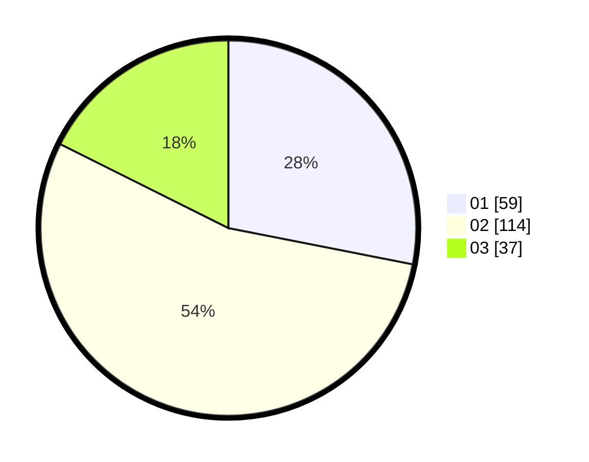

# Hasil

Hasil perolehan suara paslon dapat dilihat pada file paslon-01.txt, paslon-02.txt, dan paslon-03.txt.

Jika tidak ada, artinya data tersebut belum ada pada SIREKAP.

## Perolehan Suara

 * Paslon 01: **59**.
 * Paslon 02: **114**.
 * Paslon 03: **37**.

## Foto C Plano

https://sirekap-obj-formc.kpu.go.id/3856/pemilu/ppwp/31/72/02/10/02/3172021002004-20240217-103722--6af7a288-0b6f-4c58-bb11-88148336aa4c.jpg

https://sirekap-obj-formc.kpu.go.id/3856/pemilu/ppwp/31/72/02/10/02/3172021002004-20240217-103749--5111220a-ea3b-455a-b844-ebf70fac6bf3.jpg

https://sirekap-obj-formc.kpu.go.id/3856/pemilu/ppwp/31/72/02/10/02/3172021002004-20240217-103814--a5f63180-c6cb-4dbd-ac73-7e04bea1d302.jpg

## DATA PEMILIH TETAP

Jumlah pemilih dalam DPT: **280**.
 * L: **128**.
 * P: **152**.

## DATA PENGGUNA HAK PILIH

Jumlah pengguna hak pilih dalam DPT: **209**.
 * L: **93**.
 * P: **116**.

Jumlah pengguna hak pilih dalam DPTb: **0**.
 * L: **0**.
 * P: **0**.

Jumlah pengguna hak pilih dalam DPK: **2**.
 * L: **2**.
 * P: **0**.

Jumlah pengguna hak pilih: **211**.
 * L: **95**.
 * P: **116**.

## JUMLAH SUARA SAH DAN TIDAK SAH

JUMLAH SELURUH SUARA SAH: **210**.

JUMLAH SUARA TIDAK SAH: **1**.

JUMLAH SELURUH SUARA SAH DAN SUARA TIDAK SAH: **211**.
