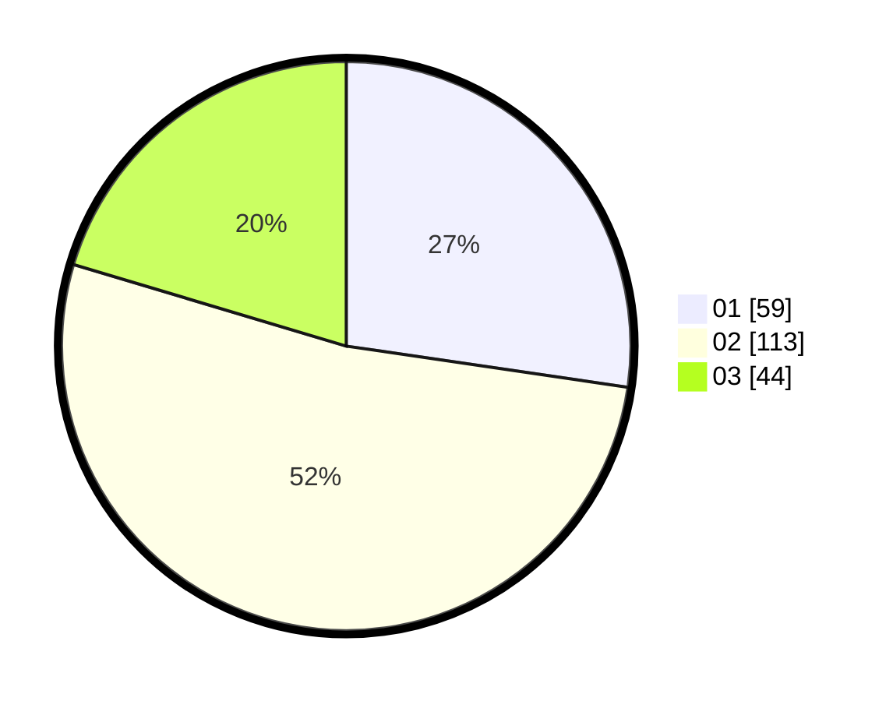

# Hasil

Hasil perolehan suara paslon dapat dilihat pada file paslon-01.txt, paslon-02.txt, dan paslon-03.txt.

Jika tidak ada, artinya data tersebut belum ada pada SIREKAP.

## Perolehan Suara

 * Paslon 01: **59**.
 * Paslon 02: **113**.
 * Paslon 03: **44**.

## Foto C Plano

https://sirekap-obj-formc.kpu.go.id/3d34/pemilu/ppwp/31/72/02/10/02/3172021002005-20240217-104357--e5a24421-2316-4140-8c58-6aa62c1e42e4.jpg

https://sirekap-obj-formc.kpu.go.id/3d34/pemilu/ppwp/31/72/02/10/02/3172021002005-20240217-104422--69251615-750b-45be-937a-86fc3e84e624.jpg

https://sirekap-obj-formc.kpu.go.id/3d34/pemilu/ppwp/31/72/02/10/02/3172021002005-20240217-104459--24a2d5dc-55ca-47c6-8f35-97521678ae7a.jpg

## DATA PEMILIH TETAP

Jumlah pemilih dalam DPT: **285**.
 * L: **148**.
 * P: **137**.

## DATA PENGGUNA HAK PILIH

Jumlah pengguna hak pilih dalam DPT: **215**.
 * L: **109**.
 * P: **106**.

Jumlah pengguna hak pilih dalam DPTb: **0**.
 * L: **0**.
 * P: **0**.

Jumlah pengguna hak pilih dalam DPK: **3**.
 * L: **3**.
 * P: **0**.

Jumlah pengguna hak pilih: **218**.
 * L: **112**.
 * P: **106**.

## JUMLAH SUARA SAH DAN TIDAK SAH

JUMLAH SELURUH SUARA SAH: **216**.

JUMLAH SUARA TIDAK SAH: **2**.

JUMLAH SELURUH SUARA SAH DAN SUARA TIDAK SAH: **218**.
