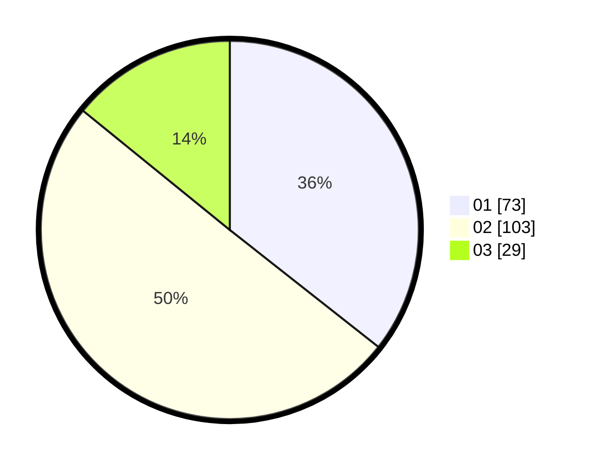

# Hasil

Hasil perolehan suara paslon dapat dilihat pada file paslon-01.txt, paslon-02.txt, dan paslon-03.txt.

Jika tidak ada, artinya data tersebut belum ada pada SIREKAP.

## Perolehan Suara

 * Paslon 01: **73**.
 * Paslon 02: **103**.
 * Paslon 03: **29**.

## Foto C Plano

https://sirekap-obj-formc.kpu.go.id/3a99/pemilu/ppwp/31/72/02/10/02/3172021002008-20240217-110552--e2a2261b-36df-4c0b-b549-5c83b989d9d7.jpg

https://sirekap-obj-formc.kpu.go.id/3a99/pemilu/ppwp/31/72/02/10/02/3172021002008-20240217-110627--1023f279-1b98-4451-a8e6-2a01a4d7b7ad.jpg

https://sirekap-obj-formc.kpu.go.id/3a99/pemilu/ppwp/31/72/02/10/02/3172021002008-20240217-110651--337dee62-9023-49d1-9572-2fb05a196449.jpg

## DATA PEMILIH TETAP

Jumlah pemilih dalam DPT: **283**.
 * L: **137**.
 * P: **146**.

## DATA PENGGUNA HAK PILIH

Jumlah pengguna hak pilih dalam DPT: **210**.
 * L: **98**.
 * P: **112**.

Jumlah pengguna hak pilih dalam DPTb: **0**.
 * L: **0**.
 * P: **0**.

Jumlah pengguna hak pilih dalam DPK: **0**.
 * L: **0**.
 * P: **0**.

Jumlah pengguna hak pilih: **210**.
 * L: **98**.
 * P: **112**.

## JUMLAH SUARA SAH DAN TIDAK SAH

JUMLAH SELURUH SUARA SAH: **205**.

JUMLAH SUARA TIDAK SAH: **5**.

JUMLAH SELURUH SUARA SAH DAN SUARA TIDAK SAH: **210**.
