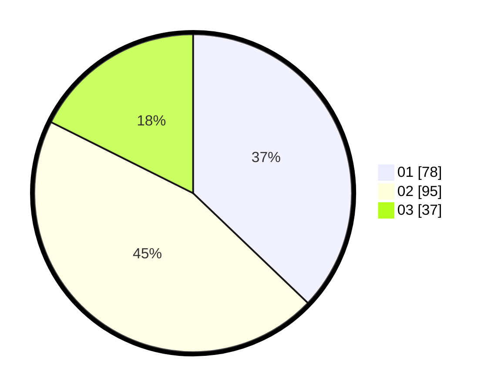

# Hasil

Hasil perolehan suara paslon dapat dilihat pada file paslon-01.txt, paslon-02.txt, dan paslon-03.txt.

Jika tidak ada, artinya data tersebut belum ada pada SIREKAP.

## Perolehan Suara

 * Paslon 01: **78**.
 * Paslon 02: **95**.
 * Paslon 03: **37**.

## Foto C Plano

https://sirekap-obj-formc.kpu.go.id/2930/pemilu/ppwp/31/72/02/10/02/3172021002010-20240217-112605--354d05e4-9df2-4de4-8041-915814615ac8.jpg

https://sirekap-obj-formc.kpu.go.id/2930/pemilu/ppwp/31/72/02/10/02/3172021002010-20240217-112630--c8101cce-a974-4b1b-a6df-59d35d87143b.jpg

https://sirekap-obj-formc.kpu.go.id/2930/pemilu/ppwp/31/72/02/10/02/3172021002010-20240217-112654--c6fc5511-b0dd-44dc-b9f6-de17812578cf.jpg

## DATA PEMILIH TETAP

Jumlah pemilih dalam DPT: **278**.
 * L: **129**.
 * P: **149**.

## DATA PENGGUNA HAK PILIH

Jumlah pengguna hak pilih dalam DPT: **215**.
 * L: **96**.
 * P: **119**.

Jumlah pengguna hak pilih dalam DPTb: **0**.
 * L: **0**.
 * P: **0**.

Jumlah pengguna hak pilih dalam DPK: **1**.
 * L: **1**.
 * P: **0**.

Jumlah pengguna hak pilih: **216**.
 * L: **97**.
 * P: **119**.

## JUMLAH SUARA SAH DAN TIDAK SAH

JUMLAH SELURUH SUARA SAH: **210**.

JUMLAH SUARA TIDAK SAH: **6**.

JUMLAH SELURUH SUARA SAH DAN SUARA TIDAK SAH: **216**.
