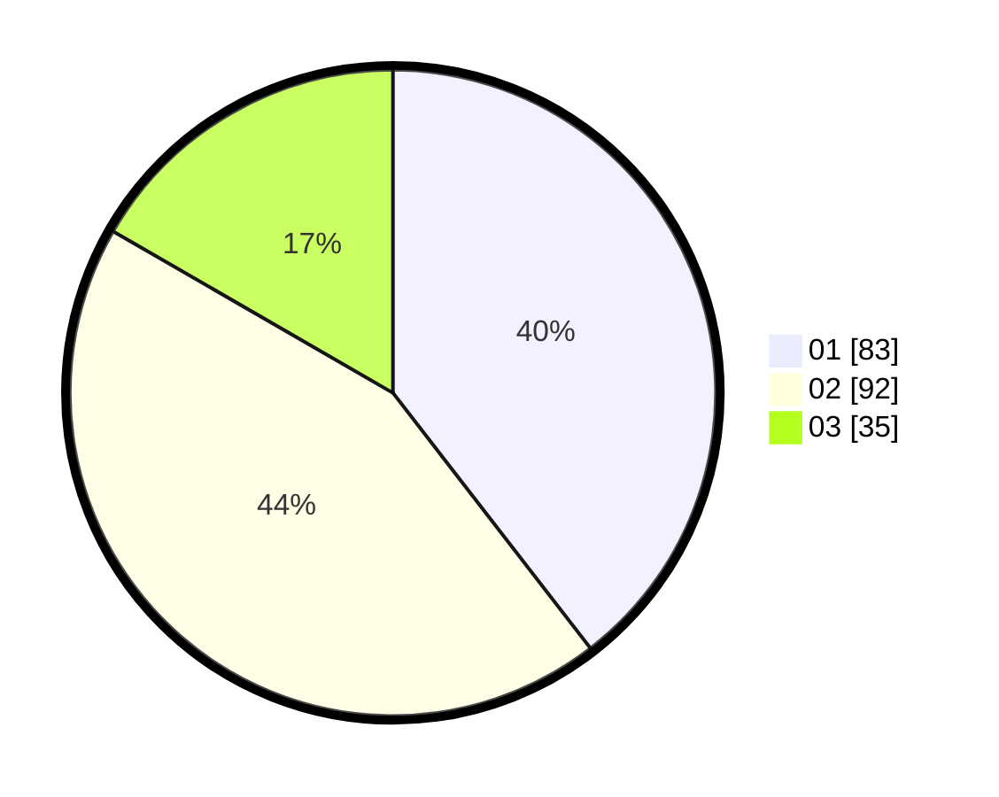

# Hasil

Hasil perolehan suara paslon dapat dilihat pada file paslon-01.txt, paslon-02.txt, dan paslon-03.txt.

Jika tidak ada, artinya data tersebut belum ada pada SIREKAP.

## Perolehan Suara

 * Paslon 01: **83**.
 * Paslon 02: **92**.
 * Paslon 03: **35**.

## Foto C Plano

https://sirekap-obj-formc.kpu.go.id/63c6/pemilu/ppwp/31/72/02/10/02/3172021002012-20240217-113555--a984229a-96d9-47ca-857e-35057c190a6e.jpg

https://sirekap-obj-formc.kpu.go.id/63c6/pemilu/ppwp/31/72/02/10/02/3172021002012-20240217-113617--b33ba9b2-d898-48d8-a998-7a21059b116d.jpg

https://sirekap-obj-formc.kpu.go.id/63c6/pemilu/ppwp/31/72/02/10/02/3172021002012-20240217-113640--ce034bd2-8692-4d6e-99b3-d4c3fe09a369.jpg

## DATA PEMILIH TETAP

Jumlah pemilih dalam DPT: **281**.
 * L: **146**.
 * P: **135**.

## DATA PENGGUNA HAK PILIH

Jumlah pengguna hak pilih dalam DPT: **212**.
 * L: **103**.
 * P: **109**.

Jumlah pengguna hak pilih dalam DPTb: **0**.
 * L: **0**.
 * P: **0**.

Jumlah pengguna hak pilih dalam DPK: **2**.
 * L: **1**.
 * P: **1**.

Jumlah pengguna hak pilih: **214**.
 * L: **104**.
 * P: **110**.

## JUMLAH SUARA SAH DAN TIDAK SAH

JUMLAH SELURUH SUARA SAH: **210**.

JUMLAH SUARA TIDAK SAH: **4**.

JUMLAH SELURUH SUARA SAH DAN SUARA TIDAK SAH: **214**.
