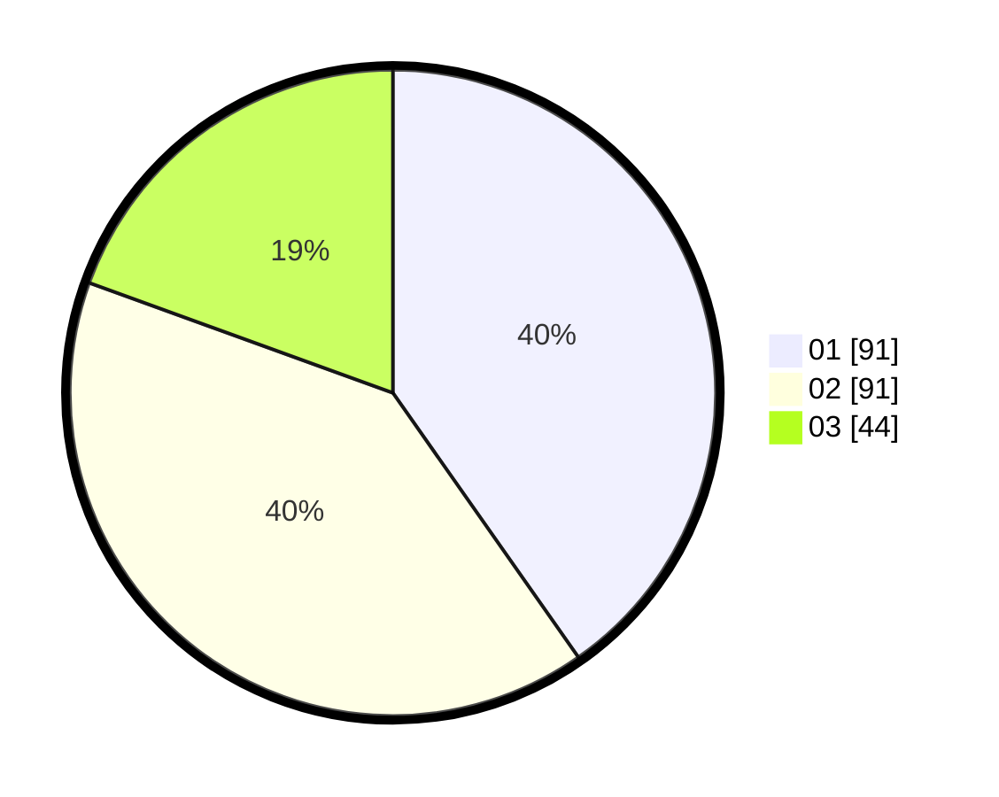

# Hasil

Hasil perolehan suara paslon dapat dilihat pada file paslon-01.txt, paslon-02.txt, dan paslon-03.txt.

Jika tidak ada, artinya data tersebut belum ada pada SIREKAP.

## Perolehan Suara

 * Paslon 01: **91**.
 * Paslon 02: **91**.
 * Paslon 03: **44**.

## Foto C Plano

https://sirekap-obj-formc.kpu.go.id/af96/pemilu/ppwp/31/72/02/10/02/3172021002013-20240217-114819--31fb8d7f-d74e-4d23-8c6e-2ebea5117746.jpg

https://sirekap-obj-formc.kpu.go.id/af96/pemilu/ppwp/31/72/02/10/02/3172021002013-20240217-114858--6013a4bd-0dea-47c0-a34e-a3a6b5055351.jpg

https://sirekap-obj-formc.kpu.go.id/af96/pemilu/ppwp/31/72/02/10/02/3172021002013-20240217-114918--5ba64f54-873e-424b-b83e-4fdf431017f7.jpg

## DATA PEMILIH TETAP

Jumlah pemilih dalam DPT: **276**.
 * L: **142**.
 * P: **134**.

## DATA PENGGUNA HAK PILIH

Jumlah pengguna hak pilih dalam DPT: **224**.
 * L: **113**.
 * P: **111**.

Jumlah pengguna hak pilih dalam DPTb: **4**.
 * L: **2**.
 * P: **2**.

Jumlah pengguna hak pilih dalam DPK: **1**.
 * L: **0**.
 * P: **1**.

Jumlah pengguna hak pilih: **229**.
 * L: **115**.
 * P: **114**.

## JUMLAH SUARA SAH DAN TIDAK SAH

JUMLAH SELURUH SUARA SAH: **226**.

JUMLAH SUARA TIDAK SAH: **3**.

JUMLAH SELURUH SUARA SAH DAN SUARA TIDAK SAH: **229**.
