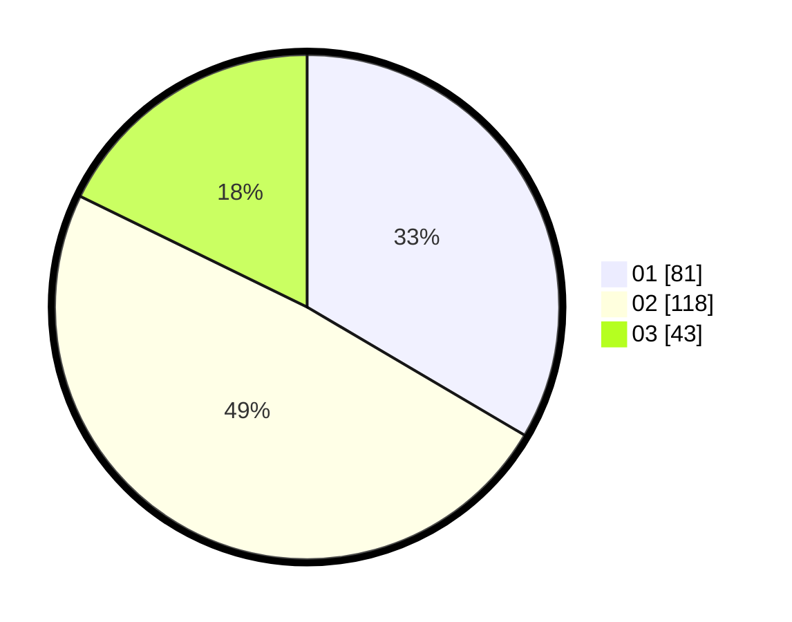

# Hasil

Hasil perolehan suara paslon dapat dilihat pada file paslon-01.txt, paslon-02.txt, dan paslon-03.txt.

Jika tidak ada, artinya data tersebut belum ada pada SIREKAP.

## Perolehan Suara

 * Paslon 01: **81**.
 * Paslon 02: **118**.
 * Paslon 03: **43**.

## Foto C Plano

https://sirekap-obj-formc.kpu.go.id/f810/pemilu/ppwp/31/72/02/10/02/3172021002014-20240217-134624--80726692-6267-4c36-8b59-939156b7fb4f.jpg

https://sirekap-obj-formc.kpu.go.id/f810/pemilu/ppwp/31/72/02/10/02/3172021002014-20240217-134646--03c1593a-14d2-48ed-abb8-f1f4cf60444d.jpg

https://sirekap-obj-formc.kpu.go.id/f810/pemilu/ppwp/31/72/02/10/02/3172021002014-20240217-133755--fa7a7f68-f51d-43f5-8dbb-d462be3a8836.jpg

## DATA PEMILIH TETAP

Jumlah pemilih dalam DPT: **286**.
 * L: **143**.
 * P: **143**.

## DATA PENGGUNA HAK PILIH

Jumlah pengguna hak pilih dalam DPT: **242**.
 * L: **119**.
 * P: **123**.

Jumlah pengguna hak pilih dalam DPTb: **0**.
 * L: **0**.
 * P: **0**.

Jumlah pengguna hak pilih dalam DPK: **1**.
 * L: **0**.
 * P: **1**.

Jumlah pengguna hak pilih: **243**.
 * L: **119**.
 * P: **124**.

## JUMLAH SUARA SAH DAN TIDAK SAH

JUMLAH SELURUH SUARA SAH: **242**.

JUMLAH SUARA TIDAK SAH: **1**.

JUMLAH SELURUH SUARA SAH DAN SUARA TIDAK SAH: **243**.
