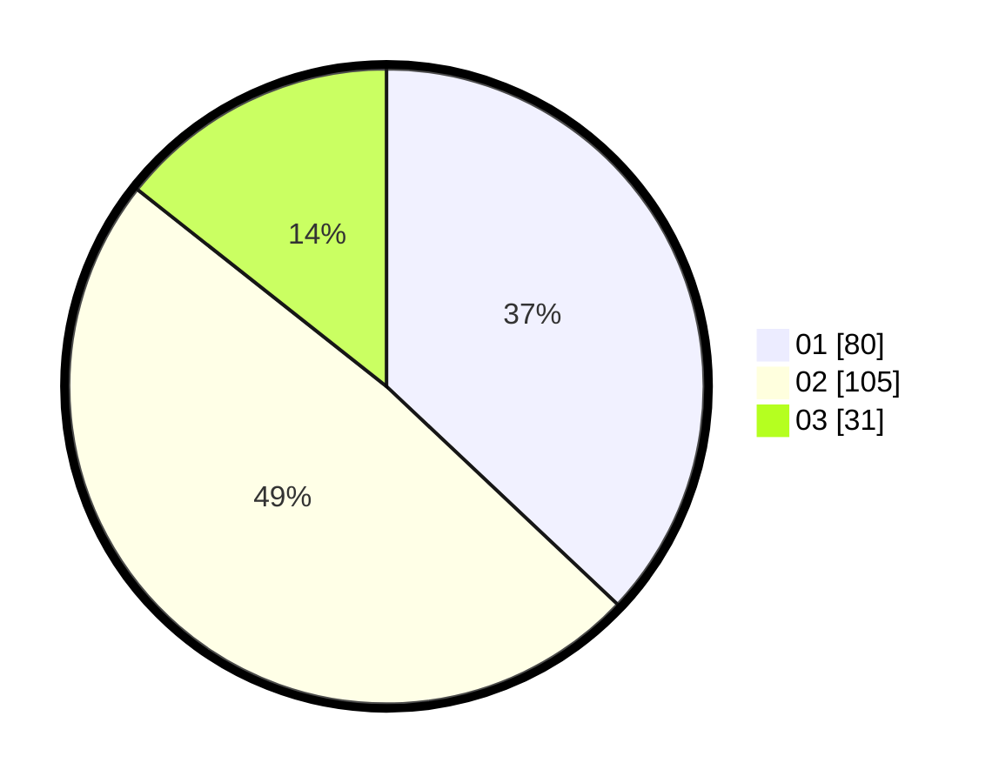

# Hasil

Hasil perolehan suara paslon dapat dilihat pada file paslon-01.txt, paslon-02.txt, dan paslon-03.txt.

Jika tidak ada, artinya data tersebut belum ada pada SIREKAP.

## Perolehan Suara

 * Paslon 01: **80**.
 * Paslon 02: **105**.
 * Paslon 03: **31**.

## Foto C Plano

https://sirekap-obj-formc.kpu.go.id/5eb5/pemilu/ppwp/31/72/02/10/02/3172021002015-20240217-135228--e29c52ff-27e8-454b-ace4-f8af5ecddf0f.jpg

https://sirekap-obj-formc.kpu.go.id/5eb5/pemilu/ppwp/31/72/02/10/02/3172021002015-20240217-135251--b5d29850-36c3-4e78-b682-1d7e2f3575ac.jpg

https://sirekap-obj-formc.kpu.go.id/5eb5/pemilu/ppwp/31/72/02/10/02/3172021002015-20240217-135444--1dc019b9-5c5b-4679-88ac-1b40a9446408.jpg

## DATA PEMILIH TETAP

Jumlah pemilih dalam DPT: **286**.
 * L: **144**.
 * P: **142**.

## DATA PENGGUNA HAK PILIH

Jumlah pengguna hak pilih dalam DPT: **213**.
 * L: **102**.
 * P: **111**.

Jumlah pengguna hak pilih dalam DPTb: **1**.
 * L: **1**.
 * P: **0**.

Jumlah pengguna hak pilih dalam DPK: **4**.
 * L: **2**.
 * P: **2**.

Jumlah pengguna hak pilih: **218**.
 * L: **105**.
 * P: **113**.

## JUMLAH SUARA SAH DAN TIDAK SAH

JUMLAH SELURUH SUARA SAH: **216**.

JUMLAH SUARA TIDAK SAH: **2**.

JUMLAH SELURUH SUARA SAH DAN SUARA TIDAK SAH: **218**.
