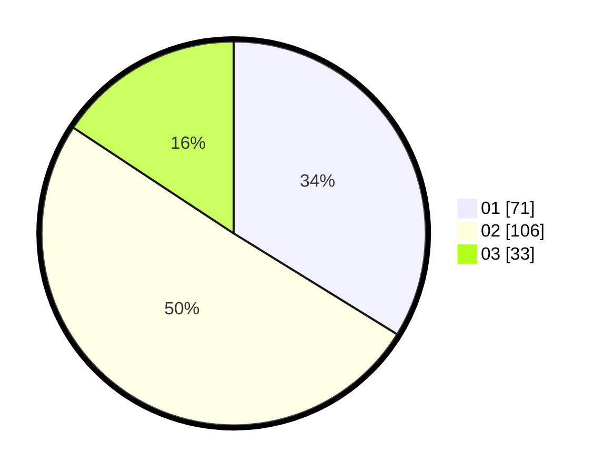

# Hasil

Hasil perolehan suara paslon dapat dilihat pada file paslon-01.txt, paslon-02.txt, dan paslon-03.txt.

Jika tidak ada, artinya data tersebut belum ada pada SIREKAP.

## Perolehan Suara

 * Paslon 01: **71**.
 * Paslon 02: **106**.
 * Paslon 03: **33**.

## Foto C Plano

https://sirekap-obj-formc.kpu.go.id/bd30/pemilu/ppwp/31/72/02/10/02/3172021002017-20240217-140447--9b38d20c-cd40-4554-ba5e-cc970b389fbd.jpg

https://sirekap-obj-formc.kpu.go.id/bd30/pemilu/ppwp/31/72/02/10/02/3172021002017-20240217-140516--7860bab5-8e53-4c13-93b9-36b8b34b5b68.jpg

https://sirekap-obj-formc.kpu.go.id/bd30/pemilu/ppwp/31/72/02/10/02/3172021002017-20240217-140542--f8df2487-7f2e-41cd-b364-661f87acdab9.jpg

## DATA PEMILIH TETAP

Jumlah pemilih dalam DPT: **278**.
 * L: **144**.
 * P: **134**.

## DATA PENGGUNA HAK PILIH

Jumlah pengguna hak pilih dalam DPT: **213**.
 * L: **111**.
 * P: **102**.

Jumlah pengguna hak pilih dalam DPTb: **0**.
 * L: **0**.
 * P: **0**.

Jumlah pengguna hak pilih dalam DPK: **0**.
 * L: **0**.
 * P: **0**.

Jumlah pengguna hak pilih: **213**.
 * L: **111**.
 * P: **102**.

## JUMLAH SUARA SAH DAN TIDAK SAH

JUMLAH SELURUH SUARA SAH: **210**.

JUMLAH SUARA TIDAK SAH: **3**.

JUMLAH SELURUH SUARA SAH DAN SUARA TIDAK SAH: **213**.
