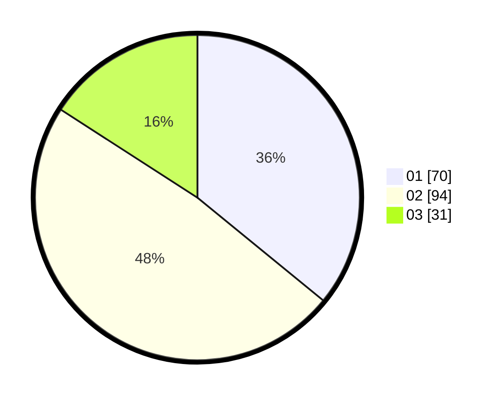

# Hasil

Hasil perolehan suara paslon dapat dilihat pada file paslon-01.txt, paslon-02.txt, dan paslon-03.txt.

Jika tidak ada, artinya data tersebut belum ada pada SIREKAP.

## Perolehan Suara

 * Paslon 01: **70**.
 * Paslon 02: **94**.
 * Paslon 03: **31**.

## Foto C Plano

https://sirekap-obj-formc.kpu.go.id/0f7f/pemilu/ppwp/31/72/02/10/02/3172021002021-20240217-144557--24ee3921-9d22-4462-97ff-ab119bffc544.jpg

https://sirekap-obj-formc.kpu.go.id/0f7f/pemilu/ppwp/31/72/02/10/02/3172021002021-20240217-144622--26d7ae83-7cdc-4acf-aadf-3afc9288ace9.jpg

https://sirekap-obj-formc.kpu.go.id/0f7f/pemilu/ppwp/31/72/02/10/02/3172021002021-20240217-144645--89d90d6d-f40a-497a-ad6a-f59ca76e5c3d.jpg

## DATA PEMILIH TETAP

Jumlah pemilih dalam DPT: **281**.
 * L: **147**.
 * P: **134**.

## DATA PENGGUNA HAK PILIH

Jumlah pengguna hak pilih dalam DPT: **195**.
 * L: **96**.
 * P: **99**.

Jumlah pengguna hak pilih dalam DPTb: **0**.
 * L: **0**.
 * P: **0**.

Jumlah pengguna hak pilih dalam DPK: **1**.
 * L: **1**.
 * P: **0**.

Jumlah pengguna hak pilih: **196**.
 * L: **97**.
 * P: **99**.

## JUMLAH SUARA SAH DAN TIDAK SAH

JUMLAH SELURUH SUARA SAH: **195**.

JUMLAH SUARA TIDAK SAH: **1**.

JUMLAH SELURUH SUARA SAH DAN SUARA TIDAK SAH: **196**.
