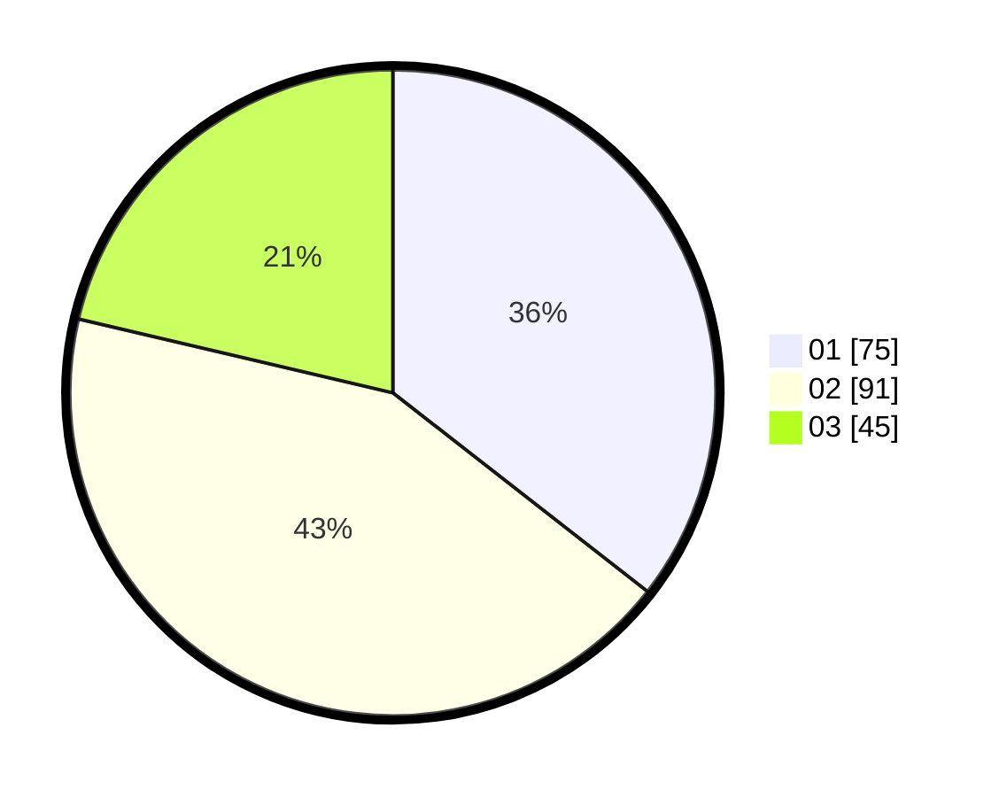

# Hasil

Hasil perolehan suara paslon dapat dilihat pada file paslon-01.txt, paslon-02.txt, dan paslon-03.txt.

Jika tidak ada, artinya data tersebut belum ada pada SIREKAP.

## Perolehan Suara

 * Paslon 01: **75**.
 * Paslon 02: **91**.
 * Paslon 03: **45**.

## Foto C Plano

https://sirekap-obj-formc.kpu.go.id/4e4b/pemilu/ppwp/31/72/02/10/02/3172021002023-20240217-150037--016d0e17-d581-4285-9f46-ea11c91929f5.jpg

https://sirekap-obj-formc.kpu.go.id/4e4b/pemilu/ppwp/31/72/02/10/02/3172021002023-20240217-150057--7d406475-8b1f-496a-9b1b-c7d37104c91f.jpg

https://sirekap-obj-formc.kpu.go.id/4e4b/pemilu/ppwp/31/72/02/10/02/3172021002023-20240217-150135--4a1f048f-d774-4771-bc8e-94e8229ccb35.jpg

## DATA PEMILIH TETAP

Jumlah pemilih dalam DPT: **280**.
 * L: **155**.
 * P: **125**.

## DATA PENGGUNA HAK PILIH

Jumlah pengguna hak pilih dalam DPT: **210**.
 * L: **115**.
 * P: **95**.

Jumlah pengguna hak pilih dalam DPTb: **0**.
 * L: **0**.
 * P: **0**.

Jumlah pengguna hak pilih dalam DPK: **3**.
 * L: **2**.
 * P: **1**.

Jumlah pengguna hak pilih: **213**.
 * L: **117**.
 * P: **96**.

## JUMLAH SUARA SAH DAN TIDAK SAH

JUMLAH SELURUH SUARA SAH: **211**.

JUMLAH SUARA TIDAK SAH: **2**.

JUMLAH SELURUH SUARA SAH DAN SUARA TIDAK SAH: **213**.
