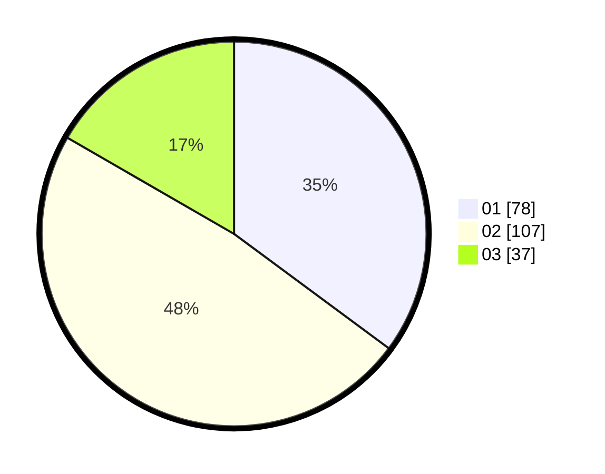

# Hasil

Hasil perolehan suara paslon dapat dilihat pada file paslon-01.txt, paslon-02.txt, dan paslon-03.txt.

Jika tidak ada, artinya data tersebut belum ada pada SIREKAP.

## Perolehan Suara

 * Paslon 01: **78**.
 * Paslon 02: **107**.
 * Paslon 03: **37**.

## Foto C Plano

https://sirekap-obj-formc.kpu.go.id/e816/pemilu/ppwp/31/72/02/10/02/3172021002024-20240217-150442--de6592e2-4334-4abb-a915-c894d9d7075b.jpg

https://sirekap-obj-formc.kpu.go.id/e816/pemilu/ppwp/31/72/02/10/02/3172021002024-20240217-150512--78935a14-27c4-47c5-b5b4-6910459987f8.jpg

https://sirekap-obj-formc.kpu.go.id/e816/pemilu/ppwp/31/72/02/10/02/3172021002024-20240217-150704--d8b89a82-9ff5-4033-a1c3-5106f096ae5c.jpg

## DATA PEMILIH TETAP

Jumlah pemilih dalam DPT: **284**.
 * L: **138**.
 * P: **146**.

## DATA PENGGUNA HAK PILIH

Jumlah pengguna hak pilih dalam DPT: **225**.
 * L: **106**.
 * P: **119**.

Jumlah pengguna hak pilih dalam DPTb: **0**.
 * L: **0**.
 * P: **0**.

Jumlah pengguna hak pilih dalam DPK: **0**.
 * L: **0**.
 * P: **0**.

Jumlah pengguna hak pilih: **225**.
 * L: **106**.
 * P: **119**.

## JUMLAH SUARA SAH DAN TIDAK SAH

JUMLAH SELURUH SUARA SAH: **222**.

JUMLAH SUARA TIDAK SAH: **3**.

JUMLAH SELURUH SUARA SAH DAN SUARA TIDAK SAH: **225**.
