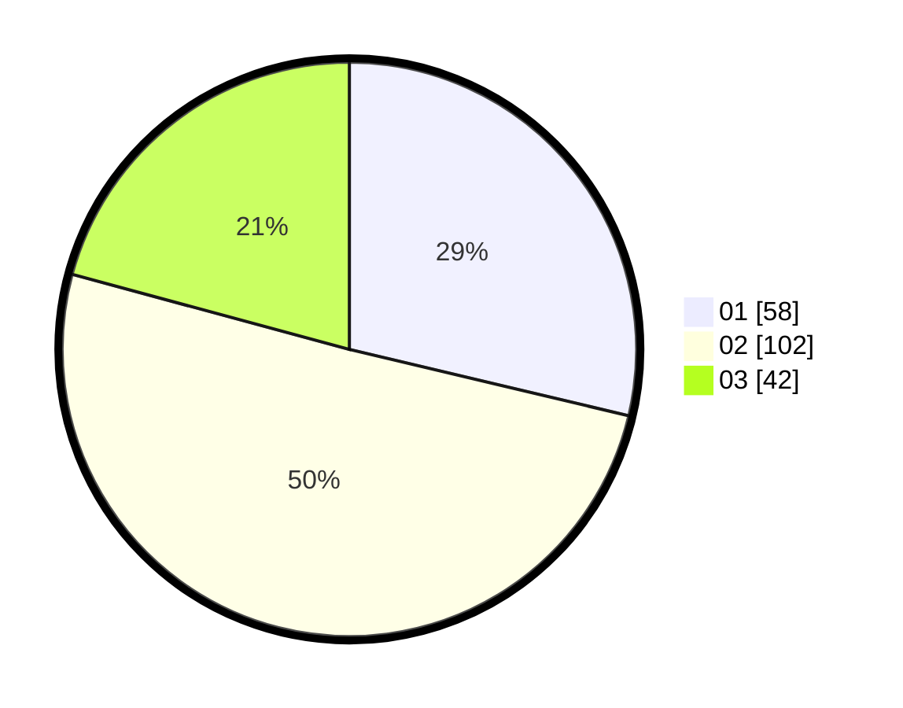

# Hasil

Hasil perolehan suara paslon dapat dilihat pada file paslon-01.txt, paslon-02.txt, dan paslon-03.txt.

Jika tidak ada, artinya data tersebut belum ada pada SIREKAP.

## Perolehan Suara

 * Paslon 01: **58**.
 * Paslon 02: **102**.
 * Paslon 03: **42**.

## Foto C Plano

https://sirekap-obj-formc.kpu.go.id/c247/pemilu/ppwp/31/72/02/10/02/3172021002027-20240216-192603--9c209c6e-0603-4d14-b997-d58c4afae1c7.jpg

https://sirekap-obj-formc.kpu.go.id/c247/pemilu/ppwp/31/72/02/10/02/3172021002027-20240216-192645--3a160dc9-53aa-432b-9d5f-a4cd1780bb7b.jpg

https://sirekap-obj-formc.kpu.go.id/c247/pemilu/ppwp/31/72/02/10/02/3172021002027-20240216-192715--6716e4f1-62ef-44af-b532-18f2f3c759ad.jpg

## DATA PEMILIH TETAP

Jumlah pemilih dalam DPT: **287**.
 * L: **139**.
 * P: **148**.

## DATA PENGGUNA HAK PILIH

Jumlah pengguna hak pilih dalam DPT: **201**.
 * L: **93**.
 * P: **108**.

Jumlah pengguna hak pilih dalam DPTb: **1**.
 * L: **0**.
 * P: **1**.

Jumlah pengguna hak pilih dalam DPK: **2**.
 * L: **1**.
 * P: **1**.

Jumlah pengguna hak pilih: **204**.
 * L: **94**.
 * P: **110**.

## JUMLAH SUARA SAH DAN TIDAK SAH

JUMLAH SELURUH SUARA SAH: **202**.

JUMLAH SUARA TIDAK SAH: **2**.

JUMLAH SELURUH SUARA SAH DAN SUARA TIDAK SAH: **204**.
