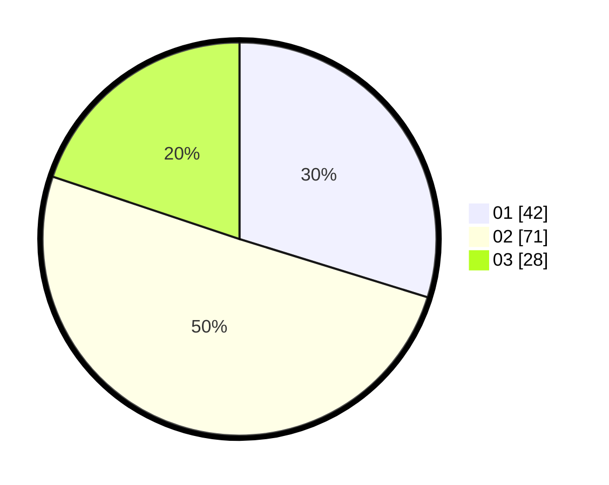

# Hasil

Hasil perolehan suara paslon dapat dilihat pada file paslon-01.txt, paslon-02.txt, dan paslon-03.txt.

Jika tidak ada, artinya data tersebut belum ada pada SIREKAP.

## Perolehan Suara

 * Paslon 01: **42**.
 * Paslon 02: **71**.
 * Paslon 03: **28**.

## Foto C Plano

https://sirekap-obj-formc.kpu.go.id/0ef0/pemilu/ppwp/31/72/02/10/02/3172021002030-20240217-165607--e2d24344-9e2f-41db-b0ff-2999a3ef7bfd.jpg

https://sirekap-obj-formc.kpu.go.id/0ef0/pemilu/ppwp/31/72/02/10/02/3172021002030-20240217-165630--41ac22dd-f1b8-4760-84b6-6f0442f17a6e.jpg

https://sirekap-obj-formc.kpu.go.id/0ef0/pemilu/ppwp/31/72/02/10/02/3172021002030-20240217-165704--2da28014-e6d4-4142-999e-15323da6a81b.jpg

## DATA PEMILIH TETAP

Jumlah pemilih dalam DPT: **213**.
 * L: **114**.
 * P: **99**.

## DATA PENGGUNA HAK PILIH

Jumlah pengguna hak pilih dalam DPT: **137**.
 * L: **72**.
 * P: **65**.

Jumlah pengguna hak pilih dalam DPTb: **2**.
 * L: **0**.
 * P: **2**.

Jumlah pengguna hak pilih dalam DPK: **3**.
 * L: **2**.
 * P: **1**.

Jumlah pengguna hak pilih: **142**.
 * L: **74**.
 * P: **68**.

## JUMLAH SUARA SAH DAN TIDAK SAH

JUMLAH SELURUH SUARA SAH: **141**.

JUMLAH SUARA TIDAK SAH: **1**.

JUMLAH SELURUH SUARA SAH DAN SUARA TIDAK SAH: **142**.
