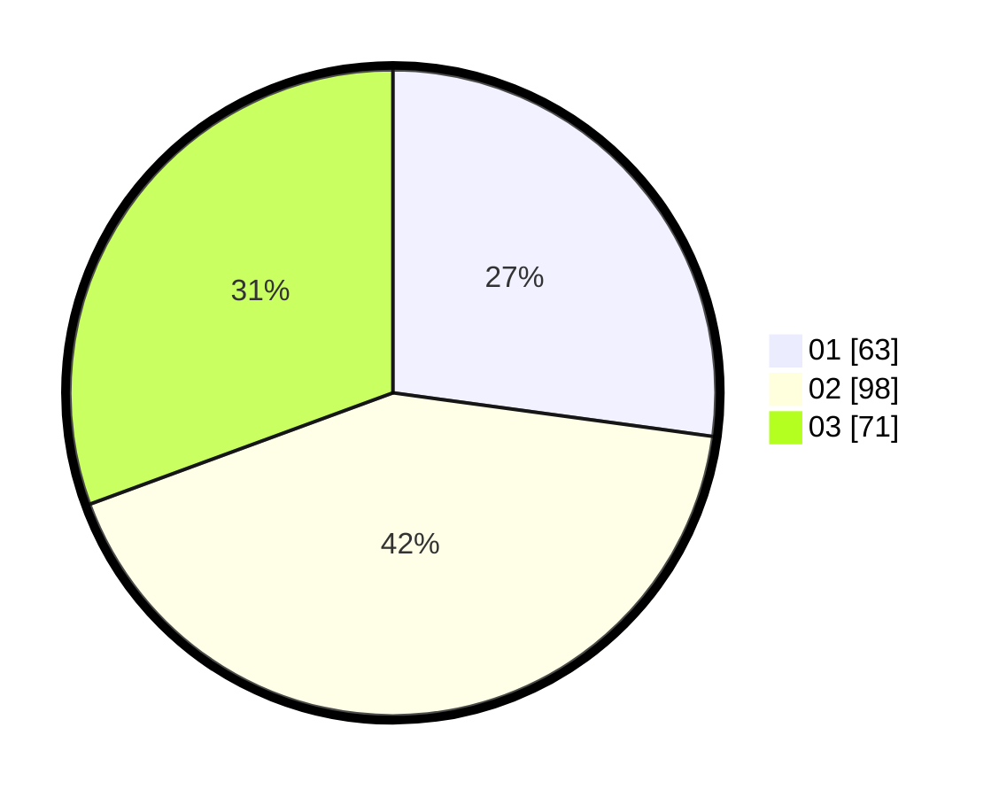

# Hasil

Hasil perolehan suara paslon dapat dilihat pada file paslon-01.txt, paslon-02.txt, dan paslon-03.txt.

Jika tidak ada, artinya data tersebut belum ada pada SIREKAP.

## Perolehan Suara

 * Paslon 01: **63**.
 * Paslon 02: **98**.
 * Paslon 03: **71**.

## Foto C Plano

https://sirekap-obj-formc.kpu.go.id/2438/pemilu/ppwp/31/72/02/10/02/3172021002031-20240217-170242--b6c462f1-5269-46fd-89fb-75d8371b8b81.jpg

https://sirekap-obj-formc.kpu.go.id/2438/pemilu/ppwp/31/72/02/10/02/3172021002031-20240217-170304--3576c00c-20c3-4e21-99b1-200e05e78522.jpg

https://sirekap-obj-formc.kpu.go.id/2438/pemilu/ppwp/31/72/02/10/02/3172021002031-20240217-170325--09a204f3-7d5b-4399-a89f-545b6df8cd96.jpg

## DATA PEMILIH TETAP

Jumlah pemilih dalam DPT: **285**.
 * L: **138**.
 * P: **147**.

## DATA PENGGUNA HAK PILIH

Jumlah pengguna hak pilih dalam DPT: **231**.
 * L: **110**.
 * P: **121**.

Jumlah pengguna hak pilih dalam DPTb: **4**.
 * L: **3**.
 * P: **1**.

Jumlah pengguna hak pilih dalam DPK: **0**.
 * L: **0**.
 * P: **0**.

Jumlah pengguna hak pilih: **235**.
 * L: **113**.
 * P: **122**.

## JUMLAH SUARA SAH DAN TIDAK SAH

JUMLAH SELURUH SUARA SAH: **232**.

JUMLAH SUARA TIDAK SAH: **3**.

JUMLAH SELURUH SUARA SAH DAN SUARA TIDAK SAH: **235**.
