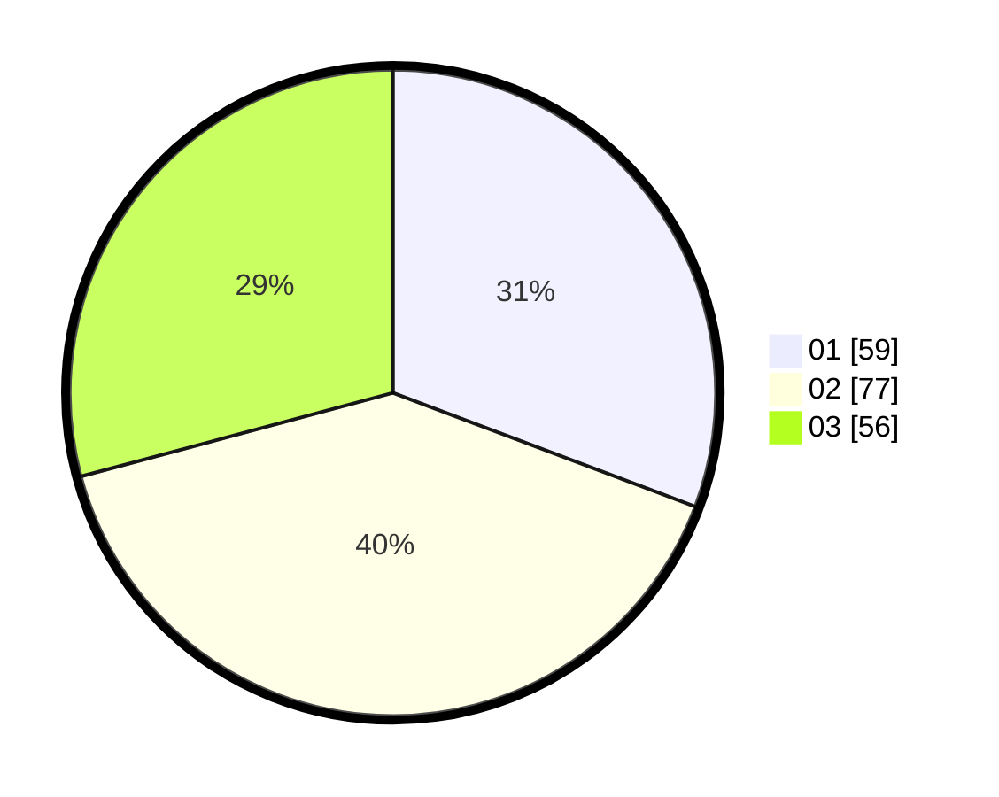

# Hasil

Hasil perolehan suara paslon dapat dilihat pada file paslon-01.txt, paslon-02.txt, dan paslon-03.txt.

Jika tidak ada, artinya data tersebut belum ada pada SIREKAP.

## Perolehan Suara

 * Paslon 01: **59**.
 * Paslon 02: **77**.
 * Paslon 03: **56**.

## Foto C Plano

https://sirekap-obj-formc.kpu.go.id/7bba/pemilu/ppwp/31/72/02/10/02/3172021002038-20240217-174021--7f1cdec7-2c65-40da-ae29-d74357e28e89.jpg

https://sirekap-obj-formc.kpu.go.id/7bba/pemilu/ppwp/31/72/02/10/02/3172021002038-20240217-174042--bf080613-0108-40b8-9b97-e1af93a1ee8b.jpg

https://sirekap-obj-formc.kpu.go.id/7bba/pemilu/ppwp/31/72/02/10/02/3172021002038-20240217-174103--c96dbd3e-2f44-45a9-961a-85348327c70a.jpg

## DATA PEMILIH TETAP

Jumlah pemilih dalam DPT: **287**.
 * L: **149**.
 * P: **138**.

## DATA PENGGUNA HAK PILIH

Jumlah pengguna hak pilih dalam DPT: **198**.
 * L: **96**.
 * P: **102**.

Jumlah pengguna hak pilih dalam DPTb: **0**.
 * L: **0**.
 * P: **0**.

Jumlah pengguna hak pilih dalam DPK: **0**.
 * L: **0**.
 * P: **0**.

Jumlah pengguna hak pilih: **198**.
 * L: **96**.
 * P: **102**.

## JUMLAH SUARA SAH DAN TIDAK SAH

JUMLAH SELURUH SUARA SAH: **192**.

JUMLAH SUARA TIDAK SAH: **6**.

JUMLAH SELURUH SUARA SAH DAN SUARA TIDAK SAH: **198**.
